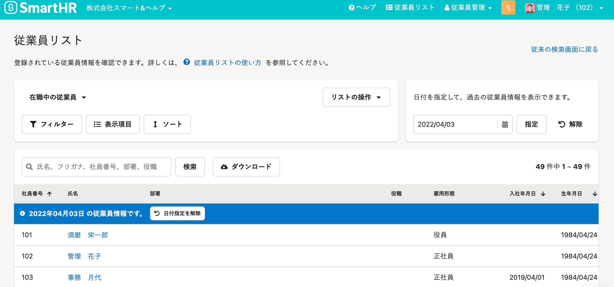

2022年4月26日（火）に行なったアップデートの詳細をお知らせします。

SmartHR基本機能の変更点は、改善2件・不具合修正1件でした。

# 📈改善
## Zipファイル作成日時（更新日時）を日本時刻で表示するようにしました

これまでは、従業員情報の一括ダウンロードなど、バックグラウンド処理でZipファイルを作成する場合、ダウンロードしたファイルの作成日時（更新日時）が「協定世界時」（日本標準時の9時間前）の表示になっていました。

いつ作成・更新されたデータか判断できるように、ファイルの作成日時は「日本標準時」を表示するようにしました。

下記のバックグラウンド処理でダウンロードできるファイルが対象です。

- ［従業員情報ダウンロード］
- ［マイナンバーの一括ダウンロード］
- ［申請一覧のCSVダウンロード］
- ［申請のCSVダウンロード］
- ［従業員情報の予約のダウンロード］
- ［給与明細PDFの全件ダウンロード］
- 手続き関連書類の［まとめてダウンロード］

## 過去の日付を指定して従業員リストを表示できるようにしました

従業員リスト画面で過去の日付を指定して、その日付時点の従業員情報を閲覧できるようにしました。

過去の日付を指定して表示したあと、 **［フィルター］** や **［表示項目］** の設定、 **［ソート］** の並べ替え、指定した日時での従業員情報をダウンロードもできます。

管理者権限のアカウントのみ利用できます。

従来の従業員リスト画面に当該機能がありましたが、従来の従業員リストの提供を終了するため、今回の対応をしました。

詳しくは、下記のお知らせとヘルプページを参照してください。

[従業員リストに過去の日付を指定して閲覧できる機能を追加し、従来の従業員リストを提供終了します](https://smarthr.jp/update/35050)

[過去の日付を指定して従業員リストを表示する](https://knowledge.smarthr.jp/hc/ja/articles/5950434616089)

# 👨‍⚕️ 不具合修正

**［会社情報］** 画面の表示に関する1件の不具合修正を行ないました。