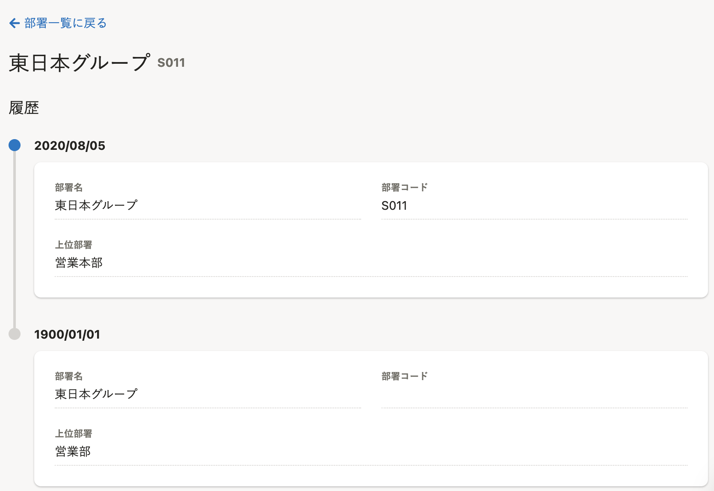
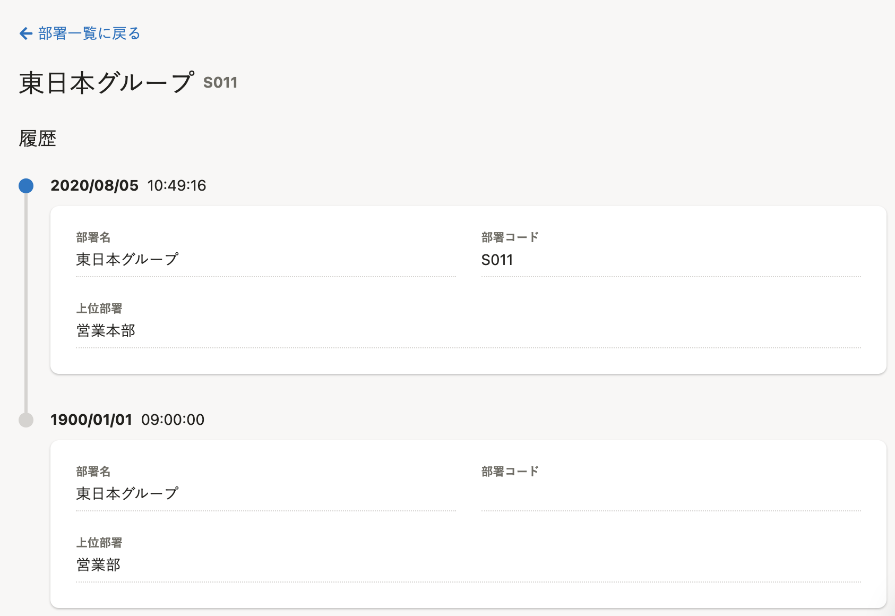
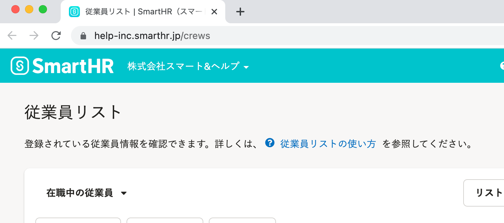

2022年5月10日（火）に行なったアップデートの詳細をお知らせします。

SmartHR基本機能の変更点は、改善2件・アクセシビリティ1件・不具合修正4件でした。

# 📈改善

## 部署マスターの履歴の適用日を時分秒まで表示するようにしました

履歴管理機能の今後の開発に向けた改善です。

これまでは、部署マスターの登録履歴の適用日は年月日（例：2022/05/10）のみの表示でした。

今回の改修により、時分秒（例：2022/05/10 17:08:30）まで表示するようにしました。

また、もっとも古い履歴の適用日は **［1900/01/01 00:00:00］** が表示されます。

:::related
[部署マスターの履歴管理機能 FAQ](https://knowledge.smarthr.jp/hc/ja/articles/6047496091801)
:::

**［共通設定］>［マスターデータ］>［部署一覧］** > 任意の部署名をクリックすると確認できます。
| 変更前 | 変更後 |
| ---- | ---- |
|  |  |

## 申請フォームと招待フォームの登録・編集画面の表示速度を改善しました

これまでは、申請フォームや招待フォームを登録・編集する際、画面を表示するまでに時間がかかることがありました。

今回の改修により、内部動作を見直し、画面の表示速度を改善しました。

# 🎢 アクセシビリティ

## 従業員リストのブラウザのタブに表示されるタイトルを変更しました

従業員リストを表示した際に表示される、ブラウザのタブのタイトルを **［従業員リスト｜SmartHR（スマートエイチアール）］** に変更しました。

| 変更前 | 変更後 |
| ---- | ---- |
|  |  |

# 👨‍⚕️ 不具合修正

未合意書類がある従業員がログインしたあとに表示される画面に関する修正など、4件の不具合修正を行ないました。