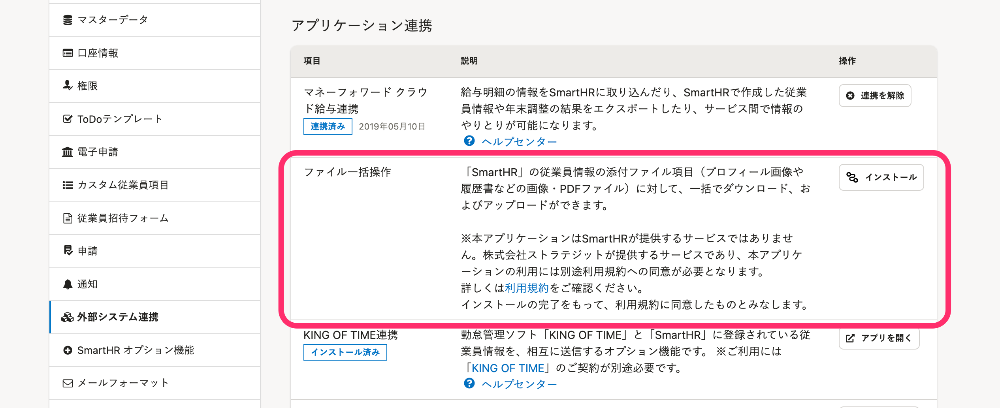

2022年5月11日（水）に行なったアップデートの詳細をお知らせします。

SmartHR基本機能の変更点は、新機能1件・不具合修正1件でした。

# ✨ 新機能

## 新機能「ファイル一括操作」をリリースしました

従来のファイル一括アップロード機能を、ファイル一括操作機能としてリニューアルしました。

ファイル一括アップロード機能は、2022年6月30日（木）に提供を終了します。

:::related
[新機能「ファイル一括操作」をリリースしました](https://smarthr.jp/update/35352)
:::

これまでのファイル一括アップロード機能は、従業員情報のファイル添付項目（プロフィール画像、履歴書・職務経歴書、給与振込の通帳画像、カスタム項目）に対して、ファイルを一括でアップロードできる機能でした。

今回リリースしたファイル一括操作機能は、一括アップロードだけでなく、一括ダウンロードにも対応し、データの出し入れがスムーズにできます。

また、対応できるファイル添付項目も増えました。

対象の項目や詳しい操作方法は、以下のヘルプページを参照してください。

[SmartHRファイル一括操作について](https://saastainer.zendesk.com/hc/ja/articles/5295873281817)

従来のファイル一括アップロード機能の操作方法は、以下のヘルプページを参照してください。
[ファイル一括アップロードの使い方](https://knowledge.smarthr.jp/hc/ja/articles/360039962514)

新しい機能は、**［外部システム連携］>［アプリケーション連携］** からインストールできます。

# 👨‍⚕️ 不具合修正

従業員情報を一括登録・更新・予約した際のバックグラウンド処理の **［エラー詳細］** に関する1件の不具合修正を行ないました。