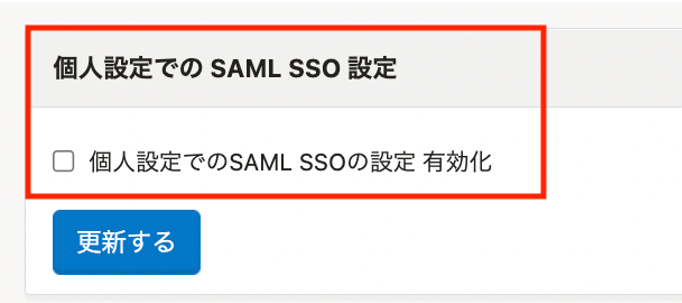
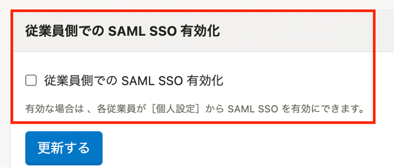

2022年5月18日（水）に行なったアップデートの詳細をお知らせします。

SmartHR基本機能の変更点は、改善1件でした。

# 📈改善

## ［SAML SSO 設定］にある従業員側で有効化する場合の文言をわかりやすくしました

これまでは、**［共通設定］ > ［SAML SSO 設定］** 画面にあった **［個人設定でのSAML SSOの設定 有効］** の「個人」が何を指すのかがわかりづらくなっていました。

今回のリリースにより、 タイトルとチェック項目の文言を **［従業員側での SAML SSO 有効化］** に変更しました。
あわせて、説明文も追加したことで、チェックを付けた場合の挙動をわかりやすくしました。

|  変更前  |  変更後  |
| ---- | ---- |
||  |
