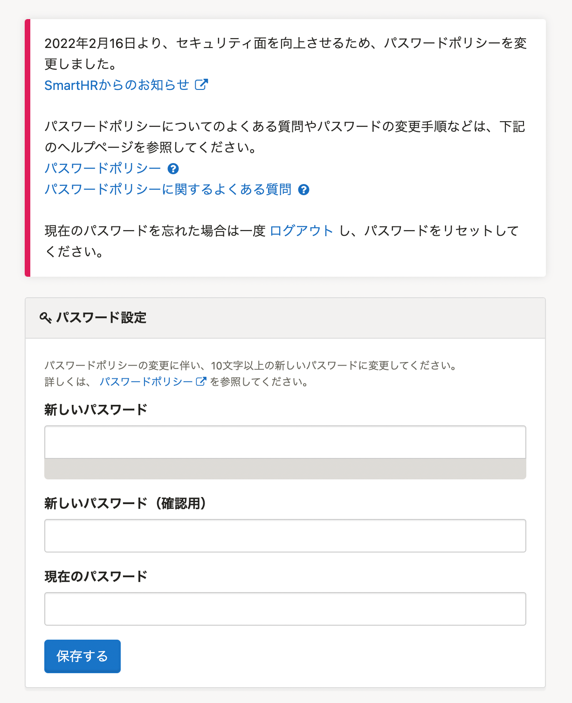

2022年5月19日（木）に行なったアップデートの詳細をお知らせします。

SmartHR基本機能の変更点は、新機能1件・不具合修正1件でした。

# ✨ 新機能

## ポリシーに沿ったパスワードに変更していない場合、ログイン後にパスワード設定画面を表示するようにしました

2022年2月16日よりSmartHRではパスワードポリシーを変更しました。

:::related
[パスワードポリシー変更に伴い、パスワードの変更をお願いします｜SmartHR](https://smarthr.jp/update/34765)
:::

5月19日にパスワードの移行期間が終了したため、変更していない場合は、ログイン後にパスワードの設定画面を表示するようにしました。

新しいパスワードポリシーに沿ったパスワードに変更したあとは、引き続きSmartHRを利用できます。

詳しくは、下記のヘルプページを参照してください。

[Q. ログイン後にパスワード設定画面が表示される場合は？](https://knowledge.smarthr.jp/hc/ja/articles/4415589321241)

# 👨‍⚕️ 不具合修正

「雇用保険被保険者離職証明書」のプレビュー表示に関する1件の不具合修正を行ないました。