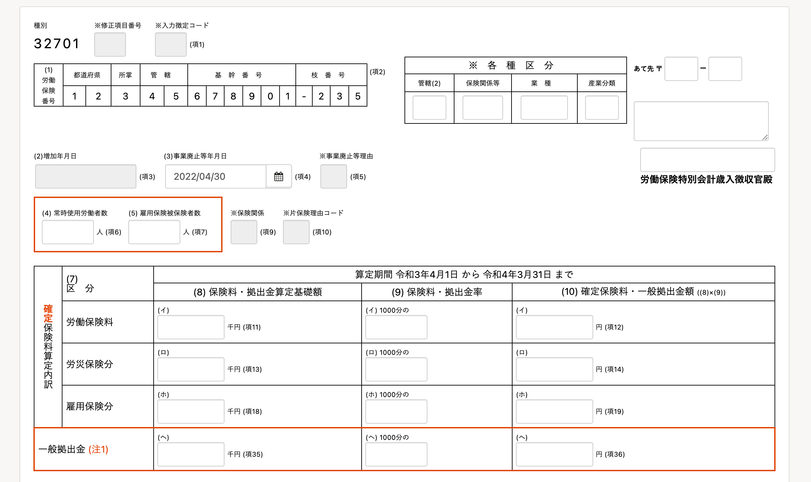
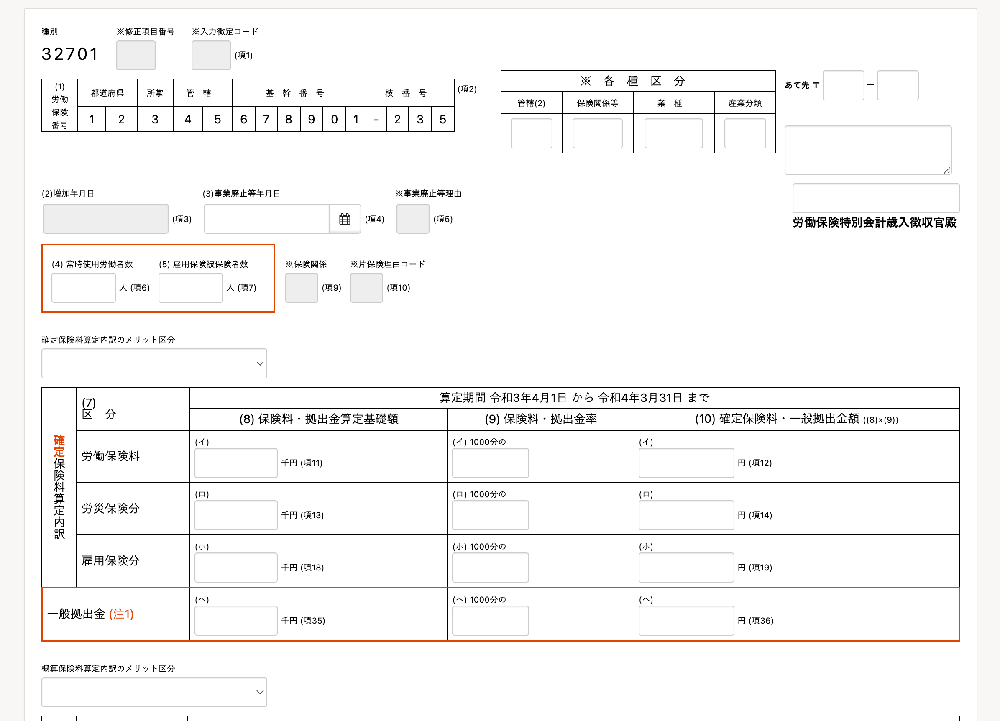
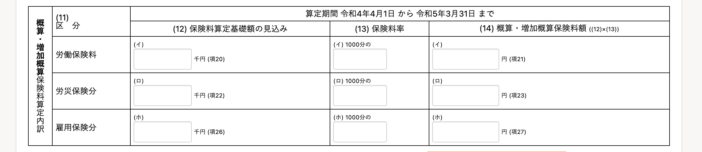
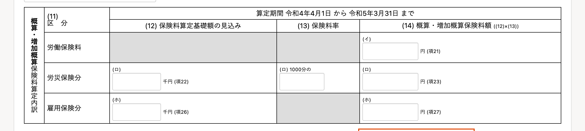
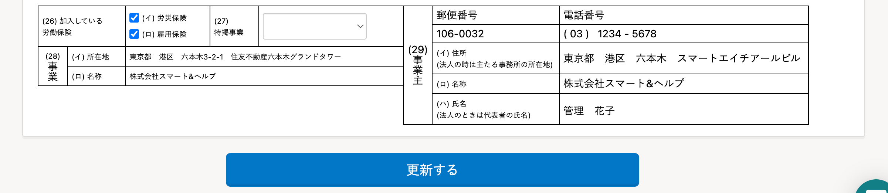
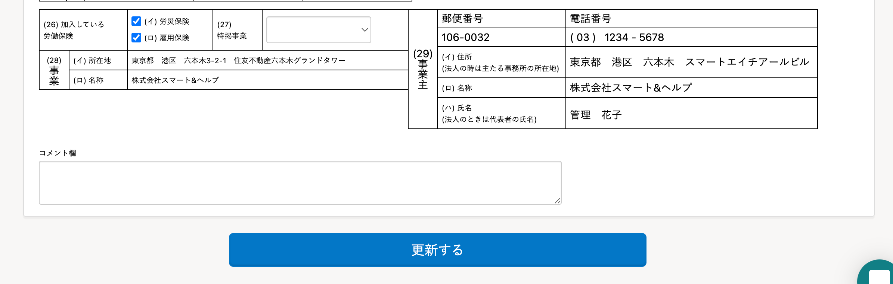
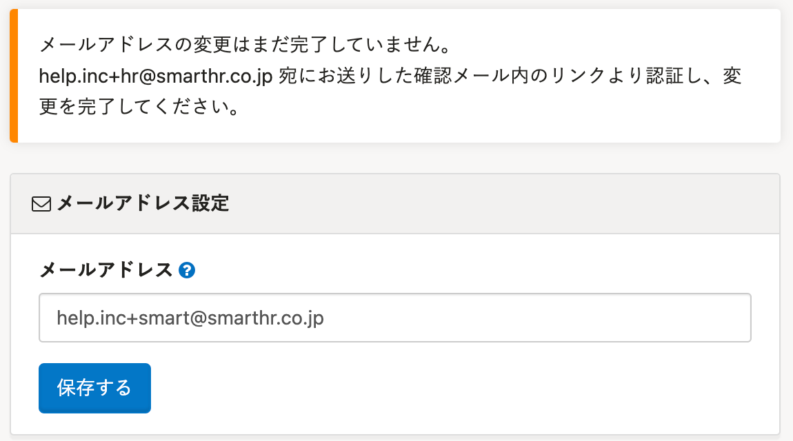
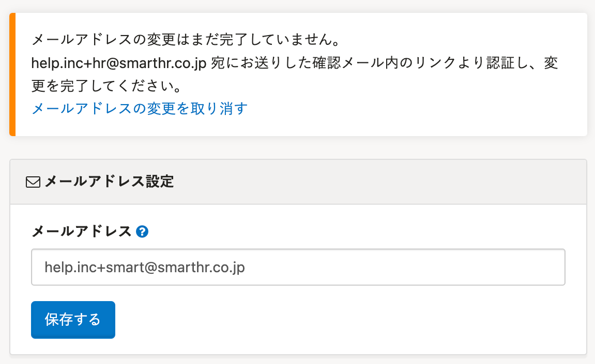

2022年5月20日（金）に行なったアップデートの詳細をお知らせします。

SmartHR基本機能の変更点は、新機能1件・改善1件・不具合修正4件でした。

# ✨ 新機能

## 令和4年の労働保険 年度更新手続きの仕様変更に対応しました

令和４年度版労働保険の年度更新手続きにおいて、e-Gov側での仕様変更があり、 **［労働保険 年度更新申告書の編集］** 画面を変更しました。

対応箇所は、下記のとおりです。

- メリット区分のプルダウンを追加しました。

|  変更前  |  変更後  |
| ---- | ---- |
|||

- 「雇用保険料率の年途中変更」に対応するため、下記の項目を入力不可に変更しました。

    - 概算・増加概算保険料算定内訳の労働保険料の（12）保険料算定基礎額の見込み
    - 概算・増加概算保険料算定内訳の労働保険料の（13）保険料率
    - 概算・増加概算保険料算定内訳の雇用保険分の（13）保険料率

|  変更前  |  変更後  |
| ---- | ---- |
|||

- 頁末にコメント欄を追加しました。

|  変更前  |  変更後  |
| ---- | ---- |
|||

# 📈改善

## メールアドレスの変更操作を取り消せるようにしました

これまでは、 **［個人設定］** からメールアドレスを変更すると、メールで送られる認証リンクをクリックするまで、 確認待ちの状態になっていました。

そのため、誤ったメールアドレスを登録したり、何らかの問題で認証メールが届かない場合に、ユーザーが解決できませんでした。

今回のリリースにより、確認待ち状態の場合、メールアドレスの変更操作を取り消せるようにしました。

|  変更前  |  変更後  |
| ---- | ---- |
|||

# 👨‍⚕️ 不具合修正

申請を承認する際の挙動に関する修正など、4件の不具合修正を行ないました。
