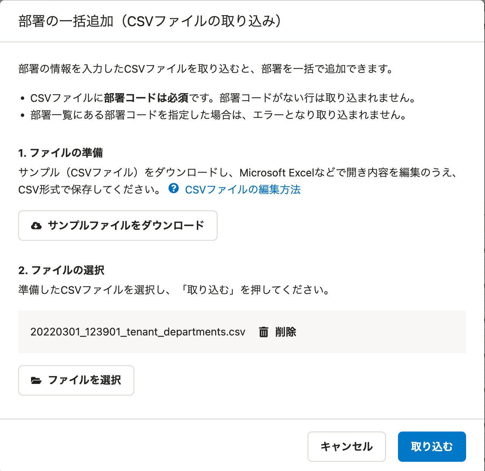
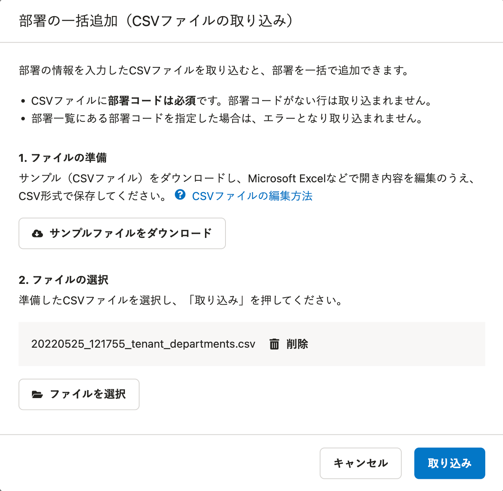

2022年5月24日（火）に行なったアップデートの詳細をお知らせします。

SmartHR基本機能の変更点は、改善1件でした。

# 📈改善

## 部署の一括追加・一括更新ダイアログにあるボタン名を変更しました

**［部署の一括追加］［部署の一括更新］** ダイアログにある、CSV取り込みを実行するボタンの文言を **［取り込む］** から **［取り込み］** に変更しました。

SmartHR全体の表記ルールに合わせた対応です。

#### ［部署の一括追加］ダイアログ

|  変更前  |  変更後  |
| ---- | ---- |
|    |     |