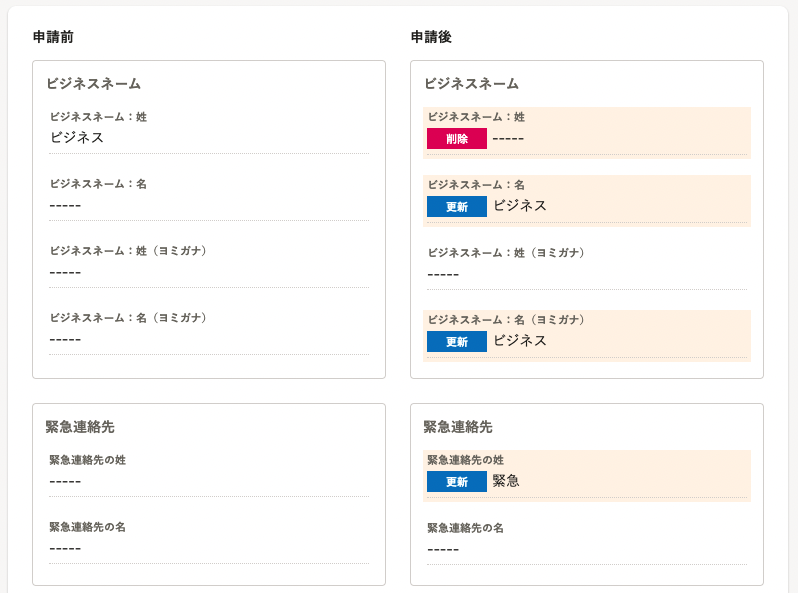
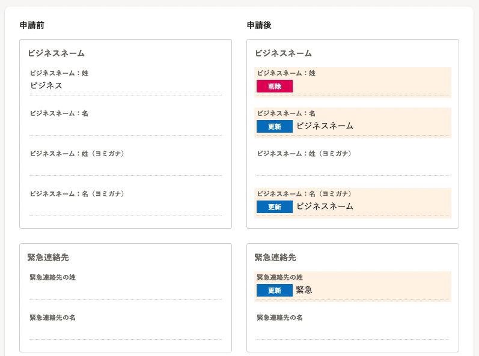

2022年5月25日（水）に行なったアップデートの詳細をお知らせします。

SmartHR基本機能の変更点は、改善1件・不具合修正1件でした。

# 📈改善

## 申請画面で、項目の値がない場合は空白で表示するようにしました

これまで申請機能の各画面で値がない場合、部署は空白、部署以外の項目は **［-----］** と表示していました。

今回のリリースにより、SmartHR全体の表記ルールにあわせ、値がない場合はすべて空白で表示にするようにしました。

#### 例：申請詳細画面

|  変更前  |  変更後  |
| ---- | ---- |
|    |    |

# 👨‍⚕️ 不具合修正

従業員招待フォームが未記入で、かつ、パスワードポリシーに沿っていないアカウントでログインした場合の挙動に関する1件の不具合修正を行ないました。
