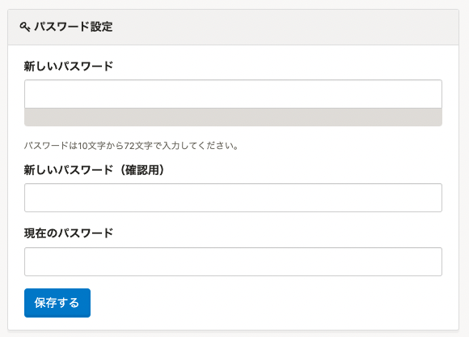
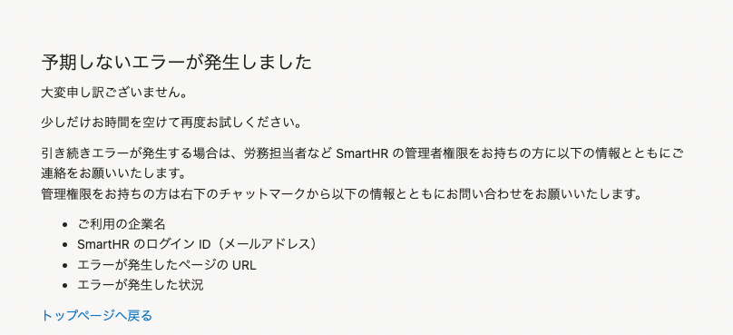
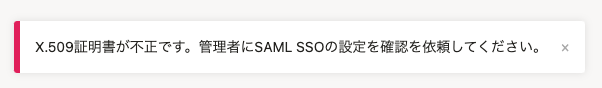

2022年5月26日（木）に行なったアップデートの詳細をお知らせします。

SmartHR基本機能の変更点は、改善2件・不具合修正1件でした。

# 📈改善

## パスワード登録・更新画面に、パスワード文字数について明示するようにしました

パスワードを登録・更新する画面に、パスワードの文字数（10文字から72文字）をヘルプテキストとして表示するようにし、設定条件をわかりやすくしました。

対象画面は下記のとおりです。

- 招待承認時にパスワードを設定する画面
- **［個人設定］>［アカウント］>［パスワード設定］** 画面
- ポリシーに沿ってないアカウントがログインした際に表示されるパスワード更新画面

#### 例：［個人設定］>［アカウント］>［パスワード設定］画面

## X.509証明書が不正な場合のエラー表示をわかりやすくしました

**［SAML SSO設定］>［X.509証明書］** で設定したX.509証明書が不正な状態で、SAML SSOでログインした際に表示されるエラー画面をわかりやすくしました。

これまでは、エラー画面から原因を特定できず、解決までに時間がかかることがありました。

今回のリリースにより、X.509証明書が不正な場合は、エラーの原因を明示するようにしました。

|  変更前  |  変更後  |
| ---- | ---- |
|    |    |

# 👨‍⚕️ 不具合修正

パスワードポリシーに沿っていないアカウントがパスワード変更した際の画面表示に関する1件の不具合修正を行ないました。