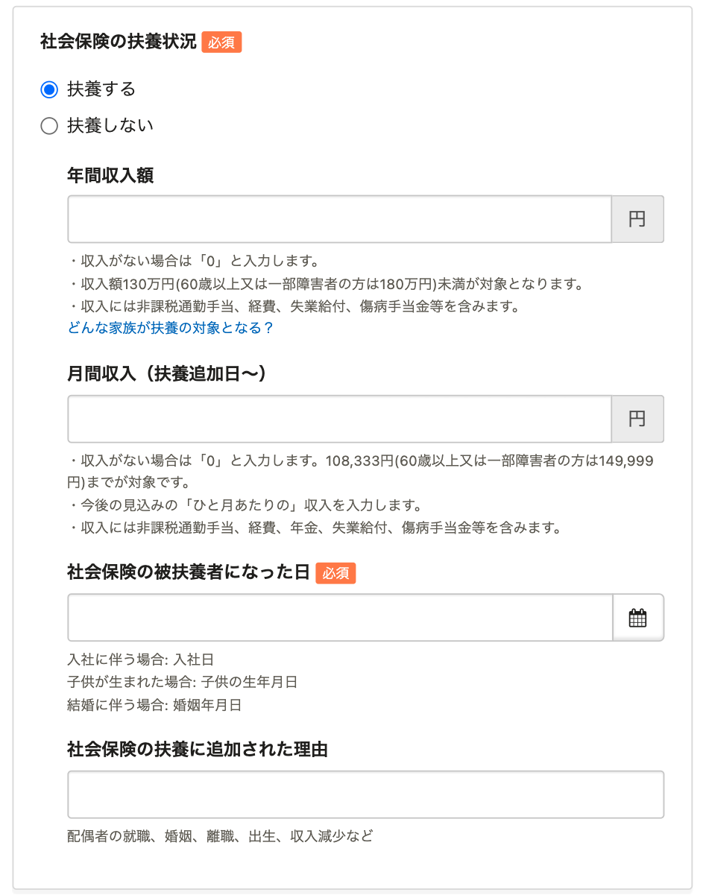
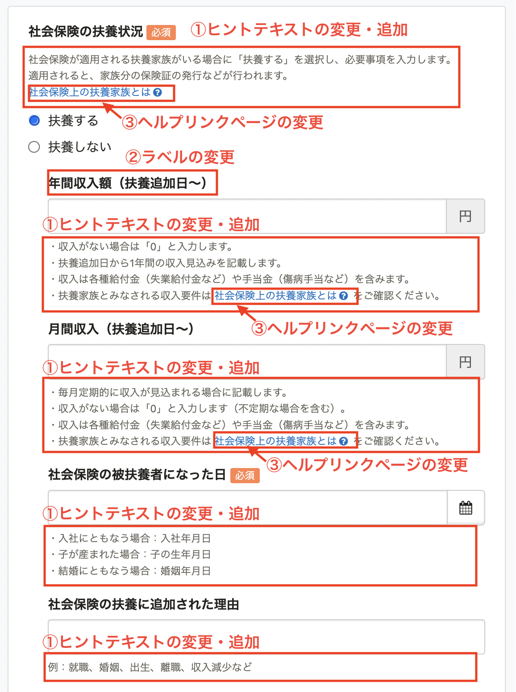

2022年5月27日（金）に行なったアップデートの詳細をお知らせします。

SmartHR基本機能の変更点は、改善1件・不具合修正2件でした。

# 📈改善

## 扶養追加フォームをわかりやすくしました

これまでの扶養追加を申請・登録する際の扶養追加フォームは、各項目に何を入力するのかわかりづらいものでした。

今回の改修により、フォームの項目にヒントやラベルを追加し、関連するヘルプページへのリンクも変更しました。

対応画面と対応箇所は、下記のとおりです。

#### 対応画面

- 扶養追加の手続き画面
- 家族追加画面
- 扶養追加の申請画面

#### 対応箇所

扶養追加のフォームの各項目にあるヒントテキストを変更・追加しました。
- ヒントテキストを変更・追加しました。
- **［年間収入額］** を **［年間収入額（扶養追加日〜）］** に変更しました。
- **［社会保険の扶養状況］** と **［税法上の扶養状況］** にあるヘルプページのリンク先をそれぞれに対応したページに変更しました。

#### 例：［扶養追加の手続き］画面の［社会保険の扶養状況］

|  変更前  |  変更後  |
| ---- | ---- |
| |   |

# 👨‍⚕️ 不具合修正

招待フォームなしで招待した際に、文書配付機能から依頼された書類がある場合の初回ログイン後の挙動に関する修正など、2件の不具合修正を行ないました。
