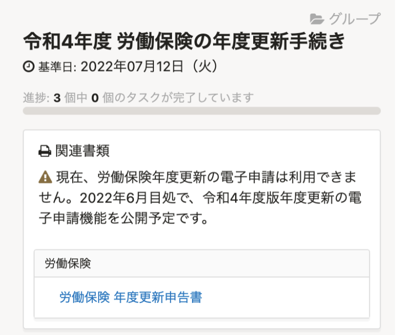
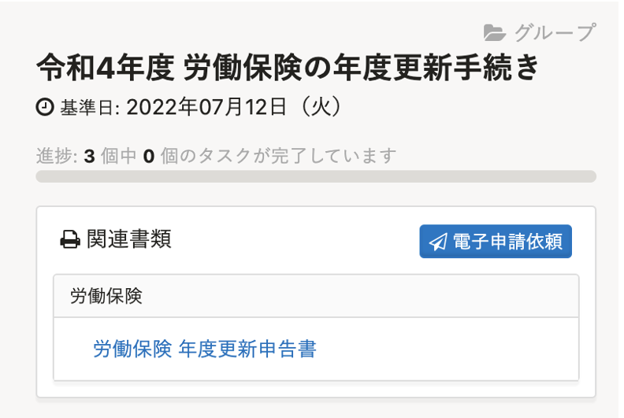

2022年5月31日（火）に行なったアップデートの詳細をお知らせします。

SmartHR基本機能の変更点は、新機能1件・改善1件・不具合修正1件でした。

# ✨ 新機能

## 令和4年度「労働保険の年度更新」の電子申請機能を公開しました

6月1日より令和４年度の「労働保険の年度更新」の電子申請ができるようになりました。
**［電子申請依頼］** を表示させ、電子申請依頼を実行できるようにしました。

|  変更前  |  変更後  |
| ---- | ---- |
|    |    |
:::related
[【令和4年度の電子申請】年度更新は6月1日（水）、定時決定は7月1日（金）に提供予定です](https://smarthr.jp/update/35428)
:::
# 📈改善

## トライアル終了画面のプラン表の文言を変更しました 

プラン名変更と機能追加に伴い、トライアル終了画面の文言を変更しました。

変更内容は下記のとおりです。

- ［スタンダードプラン］→［人事・労務エッセンシャルプラン］に変更
- ［スモールプラン］→［労務管理プラン］に変更
- ［人事情報管理］→［従業員データベース］に変更
- ［自動書類作成］→［社会保険・雇用保険］に変更

あわせて、［CSVカスタムダウンロード機能］を追加しました。

:::related
[一部プラン名称変更と新プラン公開のお知らせ](https://smarthr.jp/update/35668)
:::

# 👨‍⚕️ 不具合修正

SAML SSOアカウントが、SAML認証で外部サービスにログインした場合の挙動に関する1件の不具合修正を行ないました。
