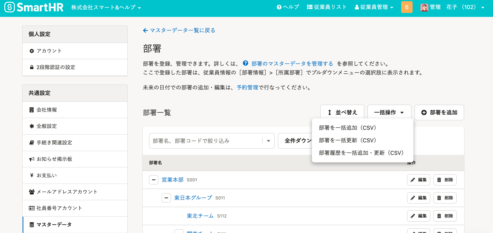
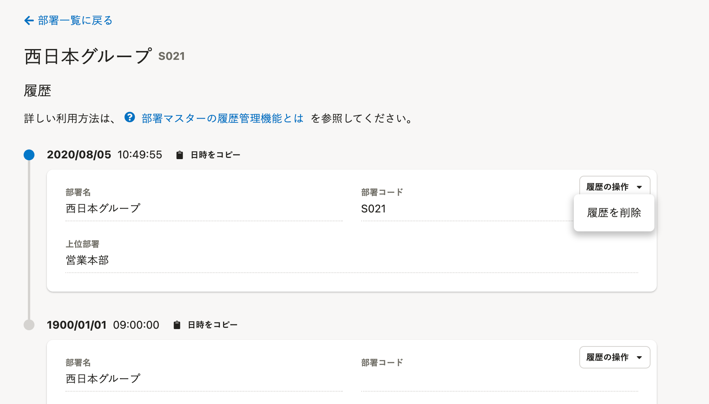
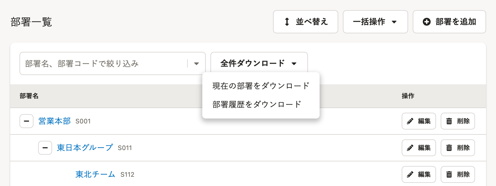

2022年6月2日（木）に行なったアップデートの詳細をお知らせします。

SmartHR基本機能の変更点は、新機能1件・不具合修正1件でした。

# ✨ 新機能

## 部署マスターの履歴を追加・更新・削除できるようにしました

これまでは、部署マスターの履歴を閲覧できるのみで、追加や更新、削除はできませんでした。

今回のリリースにより、過去の日付を指定した部署マスター履歴の追加・更新や、履歴の削除をできるようにしました。

**［共通設定］>［マスターデータ］>［部署］** にある **［一括操作］** をクリックすると、部署マスター履歴を一括追加・更新できます。

部署の詳細画面 > **［履歴の操作］>［履歴を削除］** をクリックすると、部署マスター履歴を削除できます。

**［全件ダウンロード］>［部署履歴をダウンロード］** をクリックすると、部署マスター履歴をダウンロードできます。

詳細と操作方法は、下記のお知らせとヘルプページを参照してください。

[部署マスターの履歴が追加・上書き・削除できるようになりました](https://smarthr.jp/update/35977)

[部署マスターの履歴管理機能とは](https://knowledge.smarthr.jp/hc/ja/articles/6478483663129)

# 👨‍⚕️ 不具合修正

「労働保険の年度更新手続き」を電子申請する際の書類反映に関する1件の不具合を修正しました。