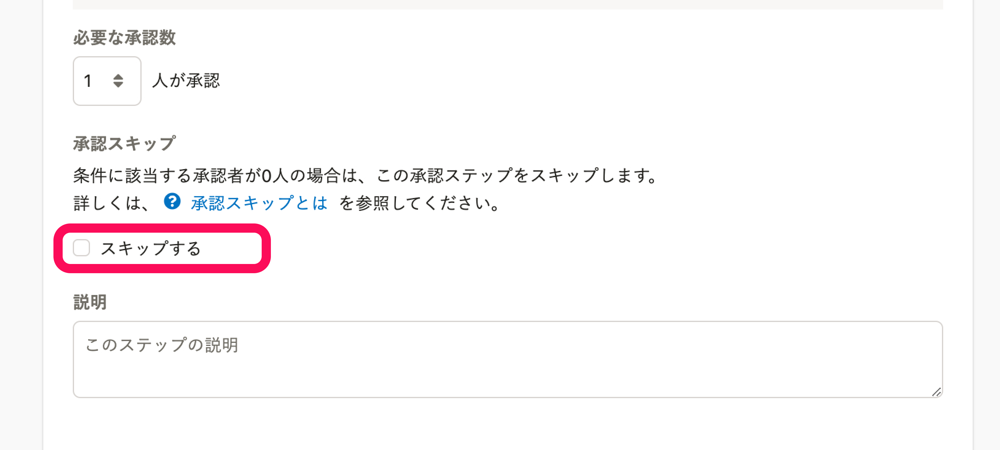

2022年6月13日（月）に行なったアップデートの詳細をお知らせします。

SmartHR基本機能の変更点は、新機能1件・改善1件でした。

# ✨ 新機能

## 申請の承認ステップをスキップできるようにしました

申請機能の承認経路で、条件に該当する承認者が不在の場合、自動的に次の承認ステップに移る設定をできるようにしました。

これまでは、部署・役職で承認者を指定する場合、部署によっては承認者が不在のため申請を提出できないケースがありました。

そのため、例えば「課長がいる経路」「課長がいない経路」をそれぞれ作成し、経路の数だけ申請フォームも用意する必要がありました。

今回のリリースにより、部署によって申請経路のステップ数が異なるケースでも、同じ種類の申請は１つの申請経路・１つの申請フォームで管理できるようにしました。

承認スキップを有効にするには、**［経路］** の新規登録・編集画面の **［承認ステップ］** > **［スキップする］** にチェックを入れてください。

詳細は、下記のお知らせとヘルプページを参照してください。

[【申請機能】承認ステップをスキップできるようになりました](https://smarthr.jp/update/36871)

[承認スキップとは](https://knowledge.smarthr.jp/hc/ja/articles/5667070547865)

# 📈改善

## 在籍期間の計算方法を見直しました

従業員情報の **［入退社情報］>［入社年月日］** に表示される在籍期間を、日も含めて計算するようにし、厳密な在籍期間で表示するようにしました。

#### 例：入社日2020年1月1日、退職日2020年12月31日の場合

- 変更前：11ヶ月
- 変更後：1年

変更範囲は、SmartHR基本機能のみです。