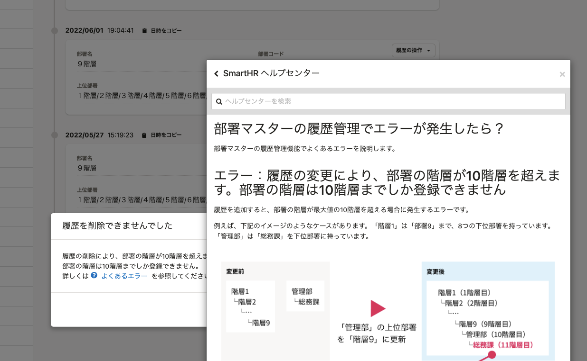

2022年6月14日（火）に行なったアップデートの詳細をお知らせします。

SmartHR基本機能の変更点は、改善2件・不具合修正1件でした。

# 📈改善

## 従業員情報を一括更新する際、「適用日＋時分秒」が一致すれば同じ日付に上書きできるようにしました

従業員情報の一括更新で **［適用日］** の項目が、日付と秒未満を切り上げた時刻が同じであれば履歴を上書きできるようにしました。

#### 例：適用日=2022/06/07 16:31:54.52349 の場合

変更前：取り込みファイルの **［適用日］** に、「2022/06/07 16:31:54.52349」を指定しないと、その適用日の履歴を上書きできませんでした。

変更後：秒未満（.52349の部分）で切り上げた「2022/06/07 16:31:55」で **［適用日］** を指定するとその履歴が上書きできるようにしました。

あわせて、 **［適用日］** に秒未満を指定できないようにしました。

今後のリリースに向けた改善です。

## ダイアログが二重に開いている際に、Escキーを押した場合の挙動を統一しました

メッセージダイアログにあるリンクからヘルプページダイアログを開いたときなど、ダイアログが二重に開いているときにEsc（エスケープ）キーを押した場合の挙動を改善しました。

これまでは、ダイアログが両方閉じたり、前面に表示されているダイアログだけが閉じる画面が混在し、挙動が異なっていました。

また、メッセージダイアログにもEscキーを押して閉じる画面と閉じない画面がありました。

ダイアログが二重に開いている際にEscキーを押すと、前面のダイアログだけが閉じるように挙動を揃えました。

また、メッセージダイアログはEscキーを押すと閉じるように挙動を揃えました。

# 👨‍⚕️ 不具合修正

バウンス状態を解除した際に表示されるメッセージに関する1件の不具合修正を行ないました。
