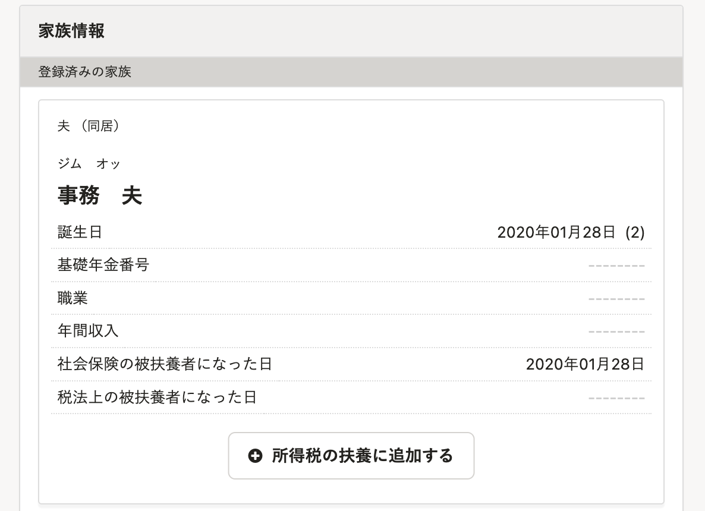
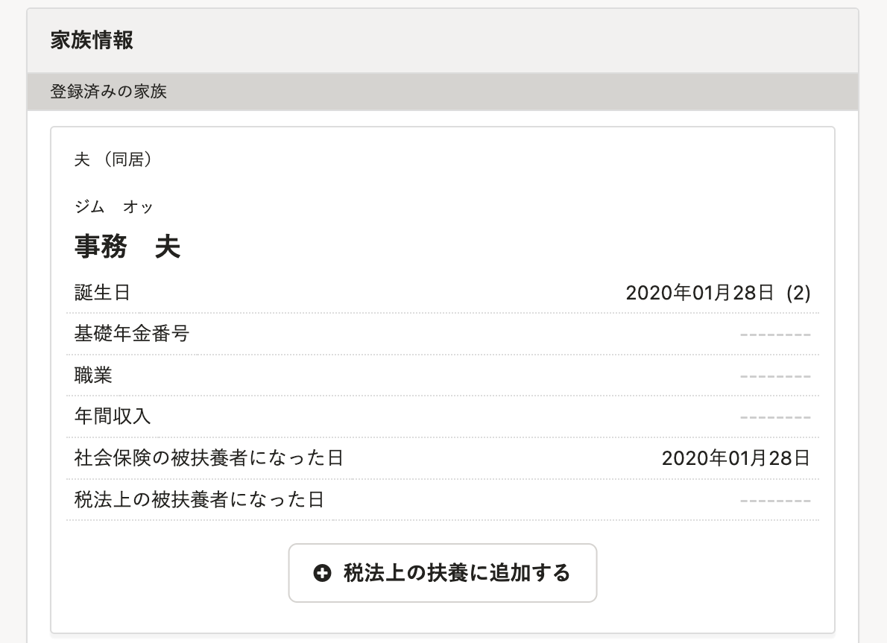

2022年6月15日（水）に行なったアップデートの詳細をお知らせします。

SmartHR基本機能の変更点は、改善1件でした。

# 📈改善

## ［所得税の扶養］を［税法上の扶養］に変更しました

家族情報の扶養追加画面に残っていた **［所得税の扶養］** という文言を **［税法上の扶養］** に変更しました。

#### 例：家族情報の扶養追加画面

|  変更前  |  変更後  |
| ---- | ---- |
|  |  |
