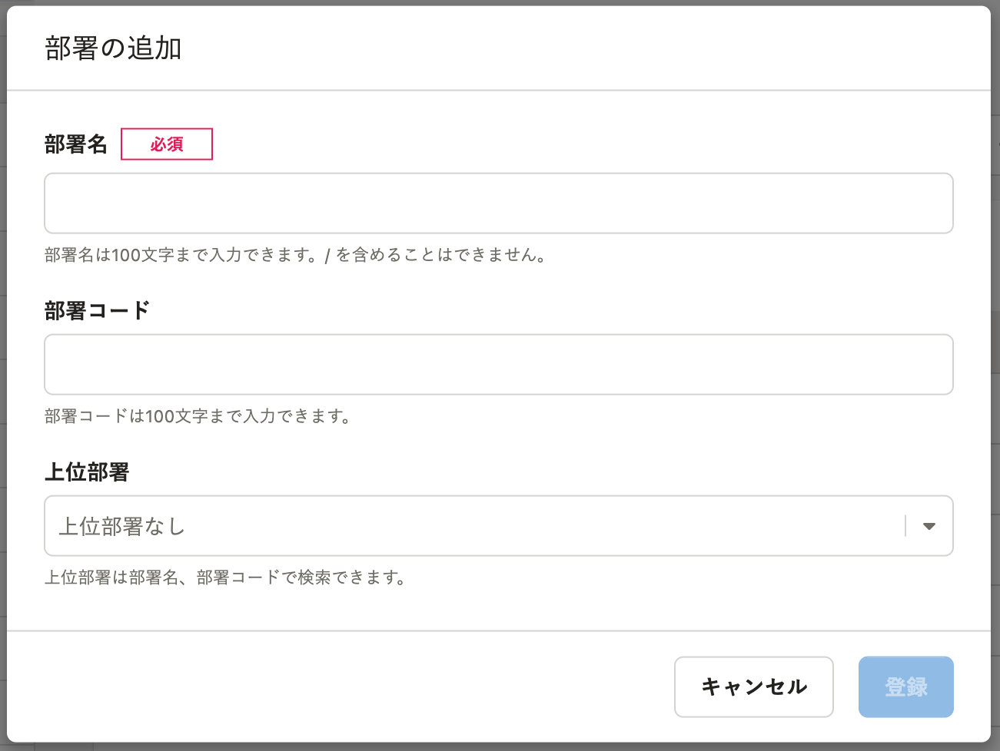

2022年6月16日（木）に行なったアップデートの詳細をお知らせします。

SmartHR基本機能の変更点は、改善2件でした。

# 📈改善

## ［部署名］の最大入力文字数を、50文字から100文字に増やしました

これまでは、部署を追加する際に表示される **［部署の追加］** ダイアログの **［部署名］** に入力できる文字数が、最大50文字でした。

50文字では不足するケースがあったため、最大100文字まで入力できるように改善しました。

## SAML SSOが有効の場合でも、X.509証明書を編集できるようにしました

これまではSAML SSOが有効の場合、X.509証明書の変更をできないようにしていましたが、SAML SSOが有効な場合でも、X.509証明書を編集できるようにしました。