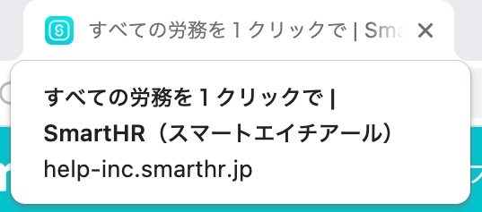
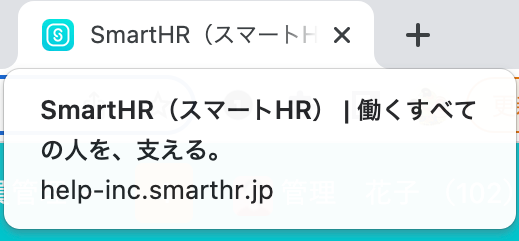
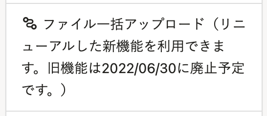
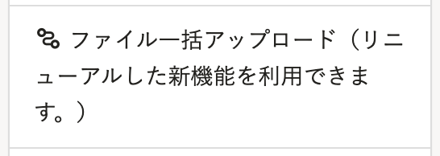

2022年6月17日（金）に行なったアップデートの詳細をお知らせします。

SmartHR基本機能の変更点は、改善2件でした。

# 📈改善

## SmartHR基本機能のタイトルを変更しました

ブラウザのタブに表示されるタイトルを下記のとおり変更しました。

- ［すべての労務を１クリックで｜SmartHR（スマートエイチアール）］→［SmartHR（スマートHR）｜働くすべての人を、支える］

あわせて、SmartHRのURLをSNSに貼った際に表示される画像（OGP）を新しくしました。

|  変更前  |  変更後  |
| ---- | ---- |
|   |   |

## ファイル一括アップロードのメニュー名から提供終了日を削除しました

トップページの **［機能］** > **［ファイル一括アップロード］** にあった **［旧機能は2022/06/30に廃止予定です］** の文言を、提供終了日が変更になったため削除しました。

|  変更前  |  変更後  |
| ---- | ---- |
| |    |

:::related
[新機能「ファイル一括操作」をリリースしました](https://smarthr.jp/update/35352)
:::
