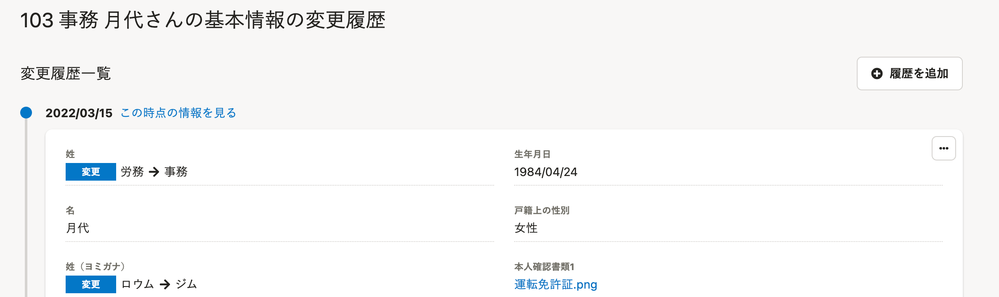
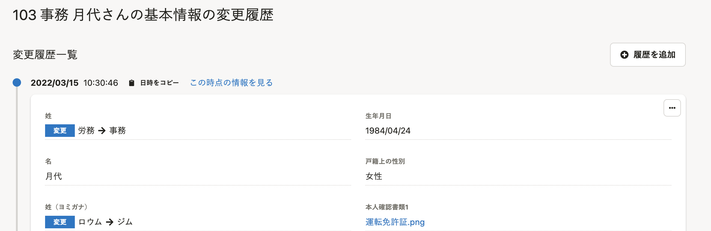
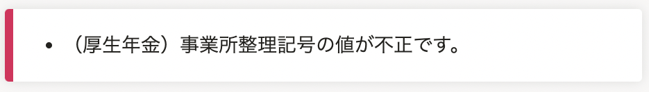
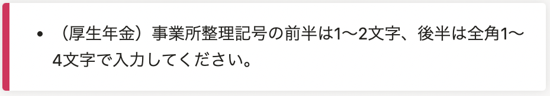
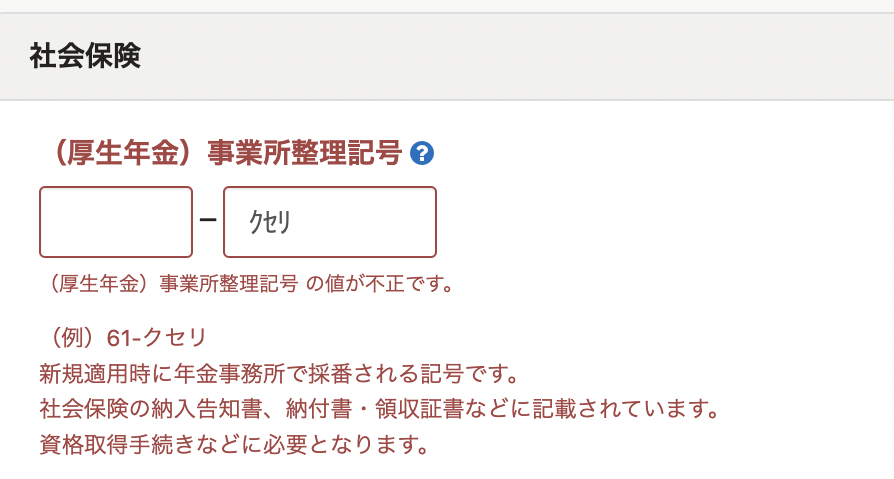
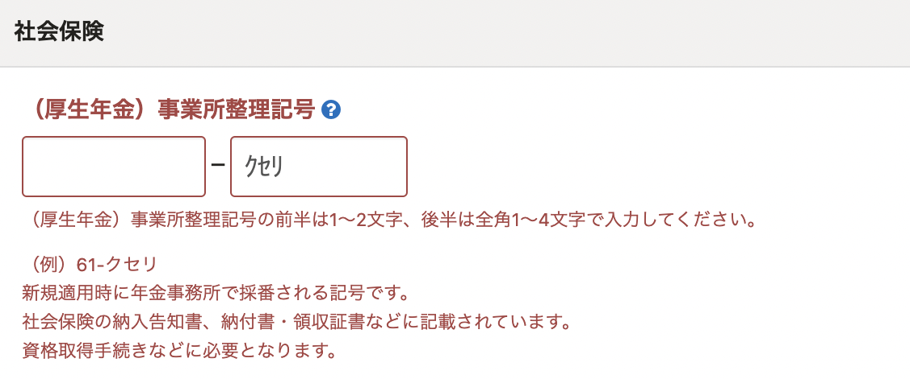

2022年6月21日（火）に行なったアップデートの詳細をお知らせします。

SmartHR基本機能の変更点は、改善2件・不具合修正1件でした。

# 📈改善

## 従業員情報の変更履歴一覧に、「年月日」＋「時分秒」を表示するようにしました

これまでは、履歴一覧の適用日が「年月日」のみの表示だったため、「時分秒」まで指定して履歴を上書きできませんでした。

適用日に「年月日」+「時分秒」を表示するようにし、履歴を上書きできるようにしました。

あわせて、**［日時をコピー］** も追加しました。

|  変更前  |  変更後  |
| ---- | ---- |
|    |    |

## ［（厚生年金）事業所整理記号］の入力規則を設定しました

これまでは、事業所情報の追加・編集で **［社会保険］>［（厚生年金）事業所整理記号］** の後半部分に半角文字を入力して登録すると、「値が不正です」のメッセージのみが表示されていました。

e-Govへの送信時に全角文字である必要があるため、半角で入力した場合は、入力規則のメッセージを表示するようにしました。

|  変更前  |  変更後  |
| ---- | ---- |
|   |    |
|    |    |

# 👨‍⚕️ 不具合修正

電子申請一覧で、ページ跨ぎのチェックを入れた際の挙動に関する1件の不具合修正を行ないました。