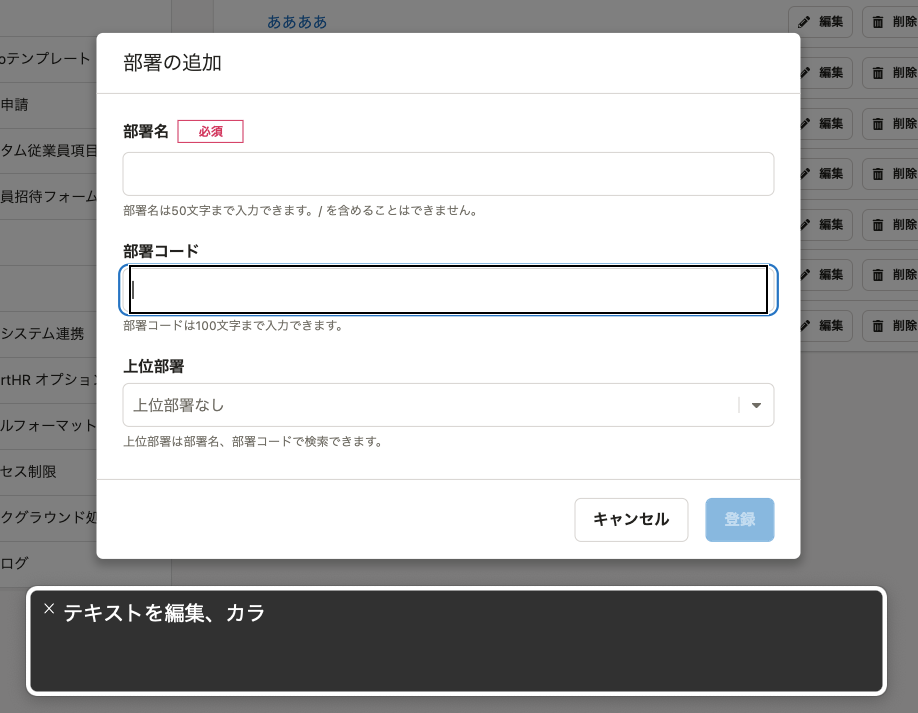
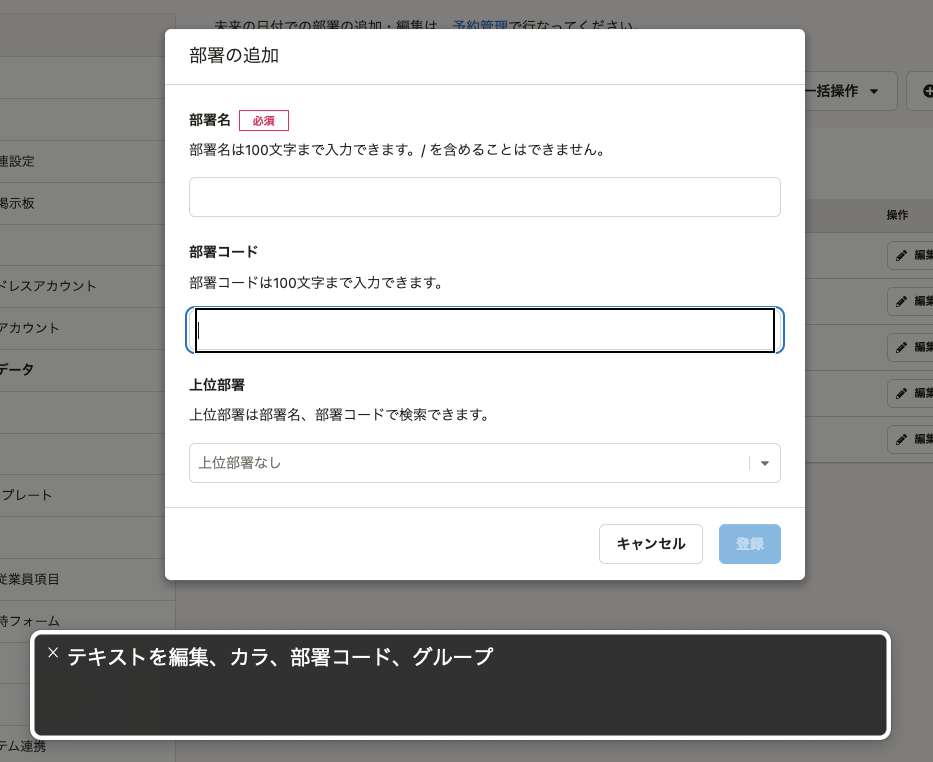

2022年6月24日（金）に行なったアップデートの詳細をお知らせします。

SmartHR基本機能の変更点は、改善1件・アクセシビリティ1件・不具合修正1件でした。

# 📈改善

## メールアドレスアカウント一覧画面、SAML SSOアカウント画面で、アカウントをビジネスネームで検索できるようにしました

メールアドレスアカウント一覧画面、SAML SSOアカウント画面で、アカウントをビジネスネームで検索できるようにしました。

SmartHR APIも変更しています。

:::related
[2022/06/24 ビジネスネームでユーザー情報を取得できるようにしました](https://support.smarthr.jp/ja/release-notes/api/2022-06-24/df46ff72-052c-4b96-9c67-950b567591c0/)
:::

# 🎢 アクセシビリティ

## 部署マスターの登録・編集画面の読み上げテキストを変更しました

これまでは、部署マスターの追加・編集画面でスクリーンリーダーを利用した際、フォームに何を入力するのかわかりませんでした。

フォームにフォーカスした際に、入力する内容がスクリーンリーダーに読み上げられるようにしました。

|  変更前  |  変更後  |
| ---- | ---- |
|    |    |

# 👨‍⚕️ 不具合修正

SAML SSOアカウント一覧のCSVファイルの項目名に関する1件の不具合修正を行ないました。