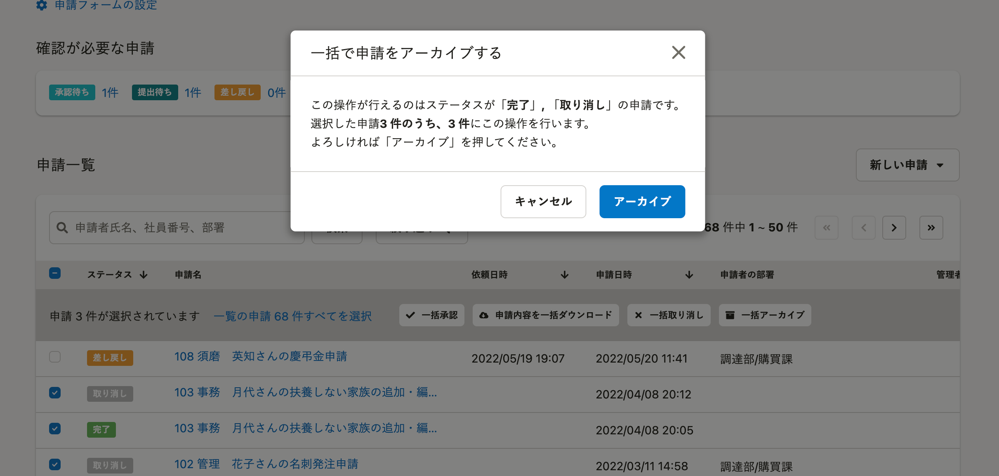

2022年6月27日（月）に行なったアップデートの詳細をお知らせします。

SmartHR基本機能の変更点は、改善1件でした。

# 📈改善

## ［取り消し］ステータスの申請をアーカイブできるようにしました

これまでは、**［申請一覧］** から **［取り消し］** ステータスの申請をアーカイブできませんでした。

進行中の申請のみを一覧で管理しやすくするため、 **［取り消し］** ステータスにした申請をアーカイブできるようにしました。

**［権限設定］** にある **［申請機能］>［依頼や承認］** の、 **［取り消し・アーカイブ］** にチェックがついている権限のみ操作できます。

:::related
- [申請一覧画面の使い方](https://knowledge.smarthr.jp/hc/ja/articles/360026262433)
- [申請を管理するためのカスタム権限の設定方法](https://knowledge.smarthr.jp/hc/ja/articles/360026262453)
:::

