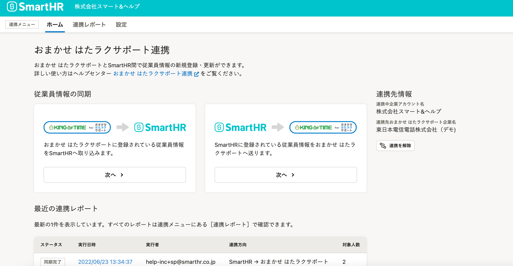

2022年6月29日（水）に行なったアップデートの詳細をお知らせします。

SmartHR基本機能の変更点は、新機能1件・改善2件でした。

# ✨ 新機能

## おまかせ はたラクサポート連携機能の画面を新しくしました

**おまかせ はたラクサポート連携** 画面を新しくし、KING OF TIME連携画面と揃えました。

また、SmartHRから **おまかせ はたラクサポート** に連携する際、ビジネスネームを優先して連携できるオプションを追加しました。

詳しくは、下記のヘルプページを参照してください。

- [【おまかせ はたラクサポート】連携設定（初回のみ）](https://knowledge.smarthr.jp/hc/ja/articles/360056035933)
- [【おまかせ はたラクサポート】従業員情報を同期する](https://knowledge.smarthr.jp/hc/ja/articles/360058038293)
- [【おまかせ はたラクサポート】同期可能な従業員情報](https://knowledge.smarthr.jp/hc/ja/articles/360056232274)

# 📈改善

## 従業員情報を取り込む際のカスタム項目に関するエラーメッセージをわかりやすくしました

従業員情報の一括登録・一括更新で発生する、カスタム項目に関するエラーメッセージを変更しました。

適用日を指定している場合の対処方法がわかりづらかったため、適用日に存在した項目名または選択肢を入力する旨を追記し、対処方法をわかりやすくしました。

#### 項目名のエラーメッセージの例

変更前：ヘッダーに入力されている項目名が誤っています(福利厚生.手当A)。

変更後：ヘッダーに入力されている「福利厚生.手当A」は存在しません。適用日を指定した場合は、適用日に存在した項目名で入力する必要があります。 

#### 選択肢のエラーメッセージの例

変更前：福利厚生.手当Aで存在しない選択肢(あり)が指定されました。

変更後：福利厚生.手当Aで選択肢「あり」は存在しません。適用日を指定した場合は、適用日に存在した選択肢を入力する必要があります。

## 適用日を指定する項目の文言を変更しました

従業員情報の登録画面と履歴追加画面で、適用日を指定する項目に表示されていた **［未来の日付は今後対応予定］** を削除しました。

未来の日付で適用日を指定する機能は、現時点では対応予定がなく、誤解を与えてしまうため文言を変更しています。
