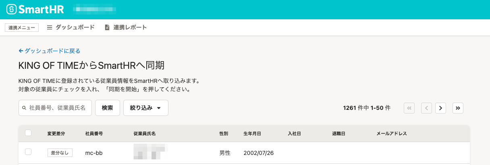

2021年8月4日（水）に行なったアップデートの詳細をお知らせします。

KING OF TIME連携の変更点は、カイゼン1件でした。

# 📈 カイゼン

## 従業員選択画面に「従業員情報取得実行日時」を表示しました

これまでは、従業員情報の取得日時は連携レポートでしか確認できませんでしたが、従業員の選択画面にも表示しました。

これにより、データ同期の際に、いつ時点のSmartHRの従業員情報が連携されているのかを確認できるようになりました。

| **Before** | **After** |
| --- | --- |
|      |  |
