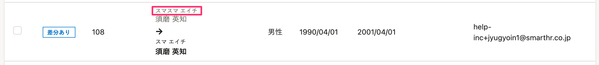

2021年12月8日（水）に行なったアップデートの詳細をお知らせします。

KING OF TIME連携の変更点は、改善1件、不具合修正2件でした。

# 📈 改善

## 従業員情報取得後の一覧画面に文字色の不揃いがあったため統一しました

従業員情報取得後の一覧画面で「差分あり」と表示されている従業員情報は、変更前後の情報を比較するために、変更前の情報は灰色、変更後の情報は黒色＋太字で表示しています。

しかし、 **［変更前の氏名ヨミガナ（カタカナ）］** の文字色のみ黒色になっていたため、 **［変更前の氏名］** の文字色とあわせて灰色に修正しました。

# 👨‍⚕️ 不具合修正

特定の操作をすると、連携状況に関わらずKING OF TIME連携ダッシュボード画面に「KING OF TIMEの連携設定を開始」が表示されてしまうなど、2件の不具合修正を行ないました。
