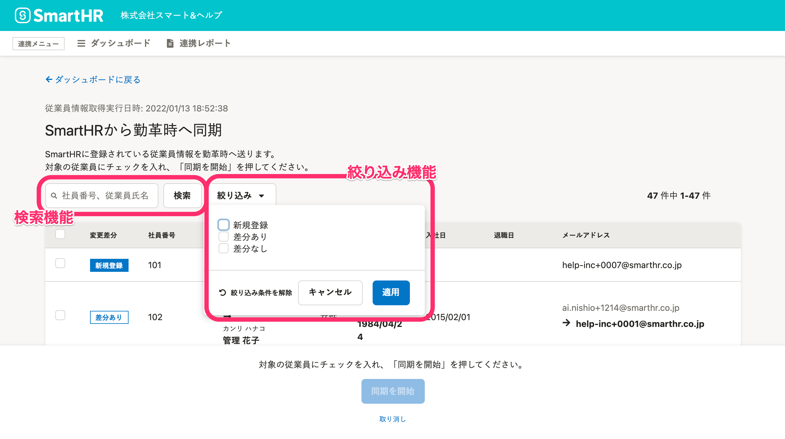
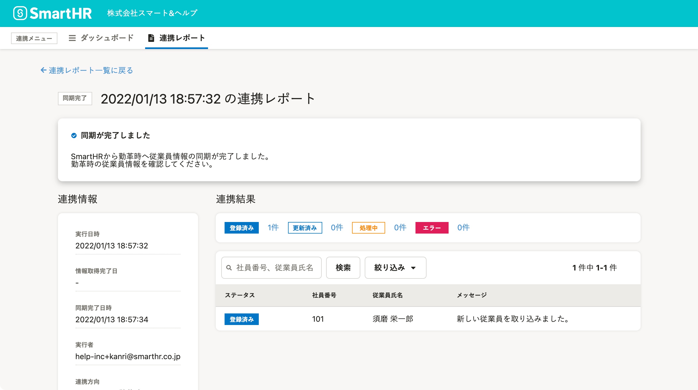
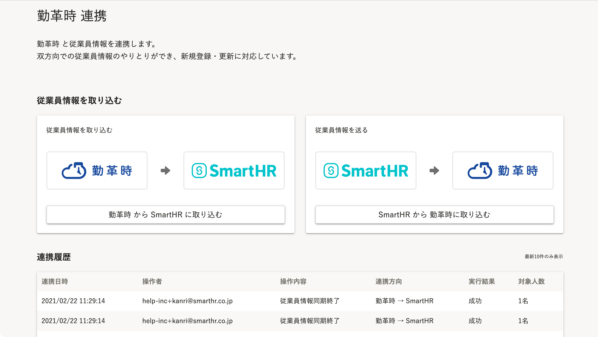
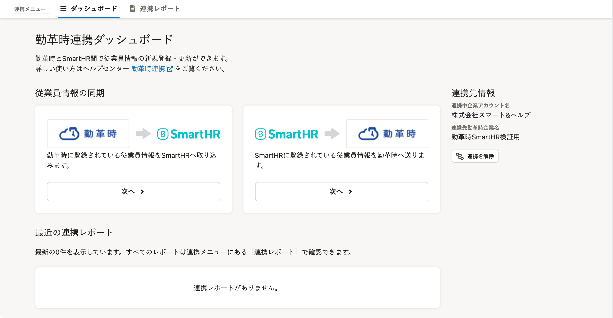

2022年1月13日（木）に行なったアップデートの詳細をお知らせします。

勤革時連携の変更点は、新機能1件でした。

# ✨ 新機能

## 勤革時連携メニューをリニューアルしました

勤革時との連携をより簡単にできるよう、新しく2つの機能を追加し、連携画面のデザインを刷新しました。

### 1\. 従業員一覧に絞り込み・検索機能を追加

これまでは、連携対象となる従業員を選択する従業員一覧に絞り込み機能、検索機能がありませんでした。

機能の追加により、社員番号・氏名による検索や、情報の変更区分（新規登録・差分あり・差分なし）による絞り込みが可能になり、連携対象の従業員が探しやすくなりました。

### 2. 連携レポート機能の追加

これまでは、連携結果はバックグラウンド処理完了時に送られる通知メールでしか確認できませんでした。

勤革時連携画面に連携レポート機能を追加したことにより、連携結果やエラー内容などの詳細を画面上で確認できるようになりました。

### 3\. 連携画面のデザインを刷新

SmartHRの本体機能とデザインを統一し、直感で操作できるように変更しました。

| **リニューアル前のデザイン** | **リニューアル後のデザイン** |
| --- | --- |
|  |  |

詳しい内容は、以下のお知らせを参照してください。

[【Touch On Time】【勤革時】連携アプリをリニューアルしました](https://smarthr.jp/update/32042)

勤革時連携機能のさらに詳しい操作方法・仕様は、以下のヘルプページを参照してください。

:::related
[【勤革時】連携設定（初回のみ）](https://knowledge.smarthr.jp/hc/ja/articles/360026262533)
[【勤革時】従業員情報を連携する](https://knowledge.smarthr.jp/hc/ja/articles/4411971255065)
[【勤革時】連携可能な従業員情報](https://knowledge.smarthr.jp/hc/ja/articles/360026262513)
[2022/3/31廃止予定【勤革時】従業員情報を取り込む](https://knowledge.smarthr.jp/hc/ja/articles/360026103934)
:::

## 注意点

### リニューアルした勤革時連携機能を利用するには、再インストールが必要です

インストール手順は、以下のヘルプページを参照してください。

[他社のアプリケーションをインストールする](https://knowledge.smarthr.jp/hc/ja/articles/4405252726041)

### 旧勤革時連携機能は、2022年3月31日（木）をもって利用できなくなります

できるだけ速やかに、新しい勤革時連携機能をインストールしてください。
