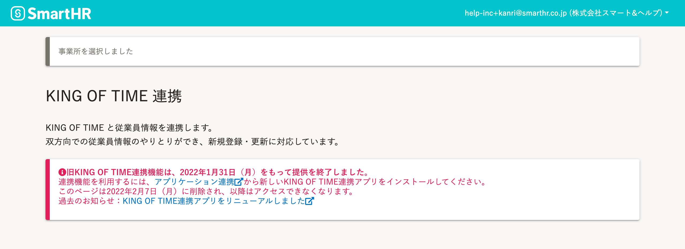

2022年2月1日（火）に行なったアップデートの詳細をお知らせします。

KING OF TIME連携の変更点は、廃止した機能1件でした。

# 👋廃止した機能

## 旧KING OF TIME連携機能を廃止しました

今回のアップデートをもって、旧KING OF TIME連携機能（リニューアル以前のKING OF TIME連携機能）を廃止しました。

旧KING OF TIME連携画面

旧KING OF TIME連携画面にアクセスしても、連携機能は利用できません。

また、旧KING OF TIME連携画面は2022年2月7日（月）に削除し、以降はアクセスできなくなります。

引き続きKING OF TIME連携機能を使うには、リニューアルしたKING OF TIME連携機能の再インストールが必要です。

インストール手順は、以下のヘルプページを参照してください。

[他社のアプリケーションをインストールする](https://knowledge.smarthr.jp/hc/ja/articles/4405252726041)
