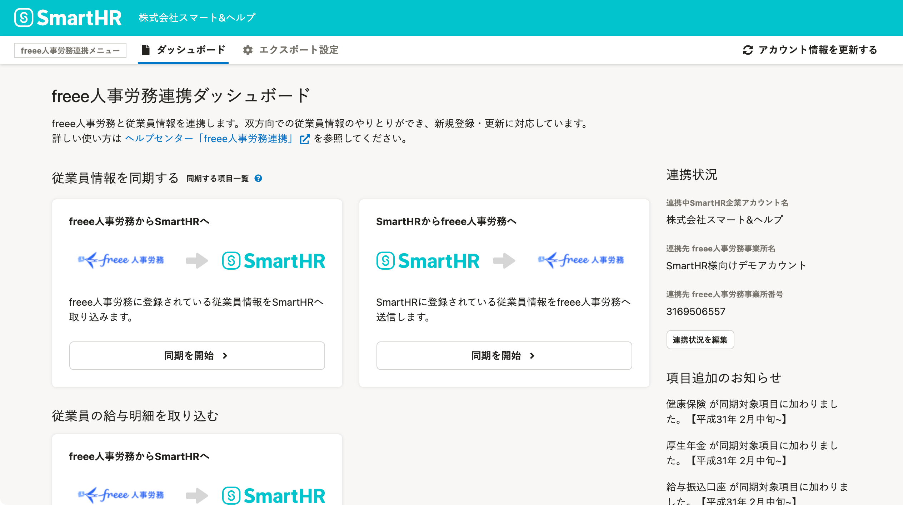

2022年2月7日（月）に行なったアップデートの詳細をお知らせします。

freee人事労務連携の変更点は、改善1件でした。

# 📈改善

## 連携先の名称を「人事労務freee」から「freee人事労務」に修正しました

連携先の名称変更に伴い、SmartHRの連携画面上の名称を以下のとおり修正しました。

- 修正前：人事労務freee
- 修正後：freee人事労務

あわせて、連携先のロゴ画像も新しいものに差し替えました。

