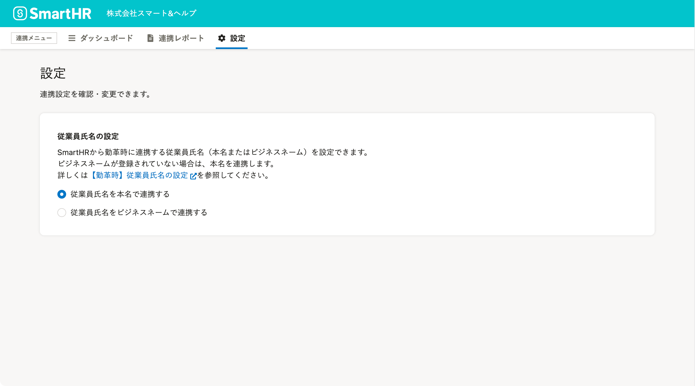

2022年3月22日（火）に行なったアップデートの詳細をお知らせします。

勤革時の変更点は、新機能1件でした。

# ✨ 新機能

## SmartHRから勤革時への連携時に、ビジネスネームを優先して連携できるようにしました

これまでは、SmartHRに登録されている従業員の本名（SmartHRの項目名［姓］［名］）でしか同期ができず、勤怠システム側でビジネスネームを表示するには、連携後に勤革時の氏名項目を修正する必要がありました。

今回のリリースで **［従業員氏名の設定］** を追加し、SmartHRから勤革時への連携時に従業員氏名を本名で連携するか、ビジネスネームで連携するかを指定できるようにしました。

:::related
[【KING OF TIME・Touch On Time・勤革時】SmartHRからビジネスネームを連携できるようになりました](https://smarthr.jp/update/34232)
:::

従業員氏名をビジネスネームで連携したい場合は、 **［従業員氏名の設定］** を変更してください。本名で連携する場合は、デフォルト設定のままで使えます。

なお、勤革時にはビジネスネームの項目がないため、勤革時からSmartHRに従業員情報を取り込む場合には、この設定は適用されません。

詳しくは[【勤革時】従業員氏名の設定](https://knowledge.smarthr.jp/hc/ja/articles/4416625776153)を参照してください。
