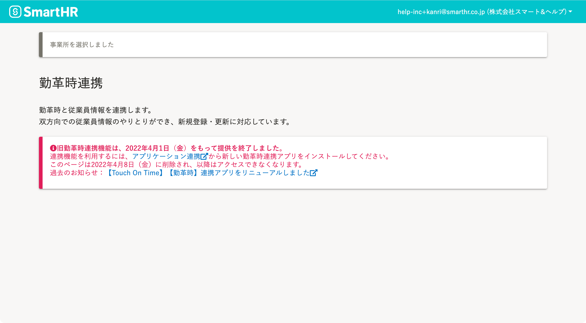

2022年4月1日（金）に行なったアップデートの詳細をお知らせします。

勤革時連携の変更点は、廃止した機能1件でした。

# 👋廃止した機能

## 旧勤革時連携機能を廃止しました

今回のアップデートをもって、旧勤革時連携機能（リニューアル以前の勤革時連携機能）を廃止しました。

旧勤革時連携画面

旧勤革時連携画面にアクセスしても、連携機能は利用できません。

また、旧勤革時連携画面は2022年4月8日（金）に削除し、以降はアクセスできなくなります。

引き続き勤革時連携機能を使うには、リニューアルした勤革時連携機能の再インストールが必要です。

インストール手順は、以下のヘルプページを参照してください。

[他社のアプリケーションをインストールする](https://knowledge.smarthr.jp/hc/ja/articles/4405252726041)
