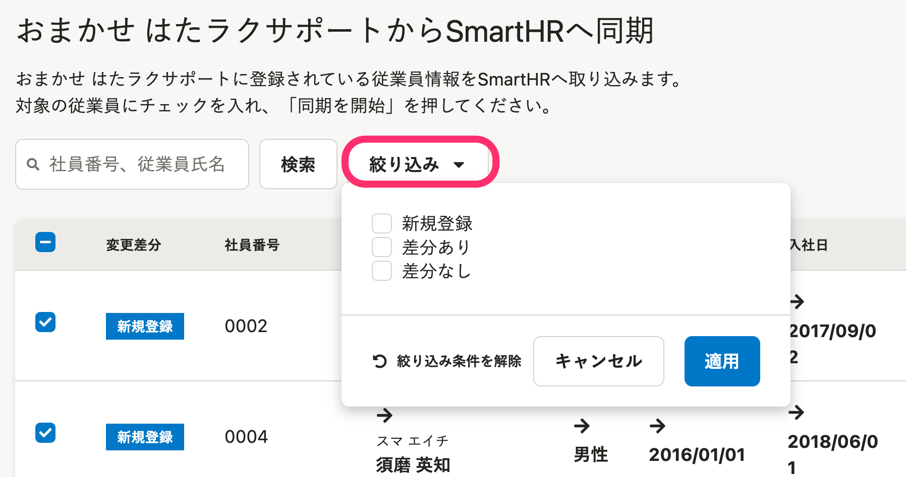

2022年6月29日（水）に行なったアップデートの詳細をお知らせします。

おまかせ はたラクサポート連携の変更点は、新機能1件でした。

# ✨ 新機能

## おまかせ はたラクサポート連携機能をリニューアルしました

おまかせ はたラクサポートとの連携をより簡単にできるよう、新しく2つの機能を追加し、連携画面のデザインを刷新しました。

### 1\. 従業員一覧に絞り込み・検索機能を追加

これまでは、連携対象となる従業員を選択する従業員一覧に絞り込み機能、検索機能がありませんでした。

機能の追加により、社員番号・氏名による検索や、情報の変更区分（新規登録・差分あり・差分なし）による絞り込みが可能になり、連携対象の従業員が探しやすくなりました。

### 2. 連携レポート機能の追加

これまでは、連携結果はバックグラウンド処理完了時に送られる通知メールでしか確認できませんでした。

おまかせ はたラクサポート連携画面に連携レポート機能を追加したことにより、連携結果やエラー内容などの詳細を画面上で確認できるようになりました。

### 3\. 連携画面のデザインを刷新

SmartHRの基本機能とデザインを統一し、直感で操作できるように変更しました。

おまかせ はたラクサポート連携機能のさらに詳しい操作方法・仕様は、以下のヘルプページを参照してください。

:::related
[【おまかせ はたラクサポート】連携設定（初回のみ）](https://knowledge.smarthr.jp/hc/ja/articles/360056035933)
[【おまかせ はたラクサポート】従業員情報を同期する](https://knowledge.smarthr.jp/hc/ja/articles/360058038293)
[【おまかせ はたラクサポート】連携可能な従業員情報](https://knowledge.smarthr.jp/hc/ja/articles/360056232274)
[【おまかせ はたラクサポート】従業員氏名の設定](https://knowledge.smarthr.jp/hc/ja/articles/7775490180761)
:::
