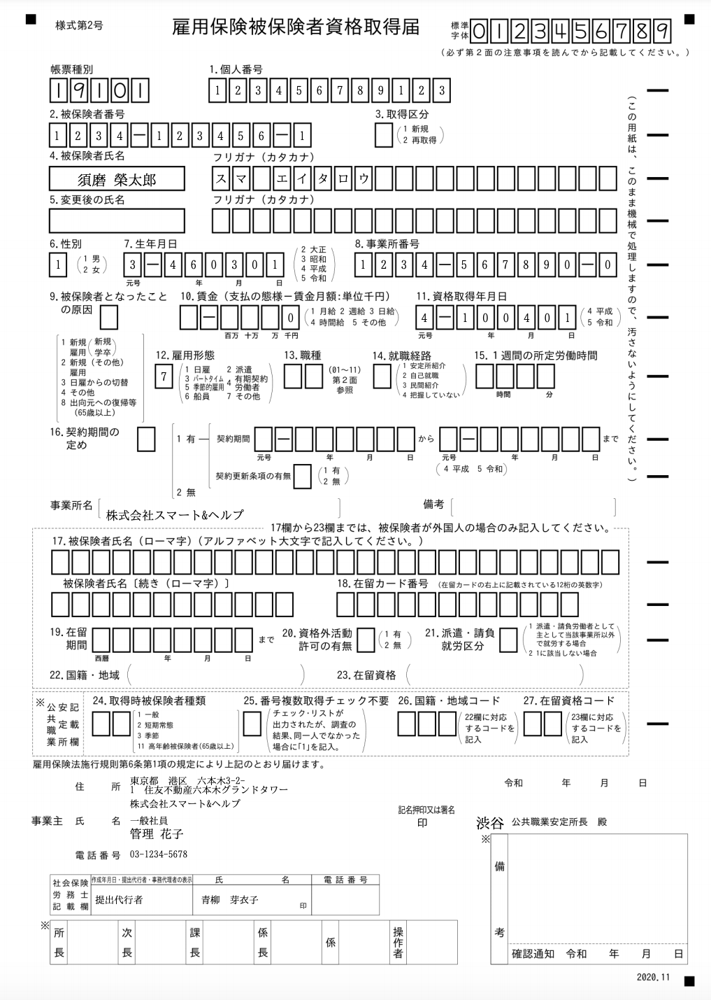
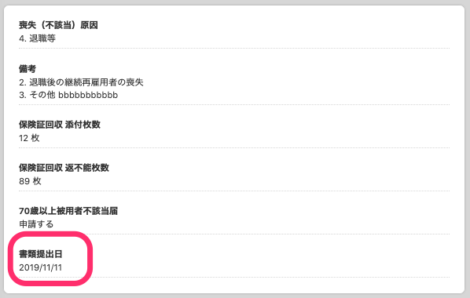
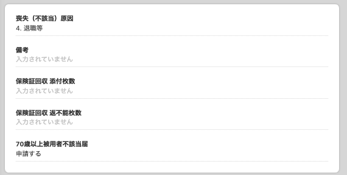
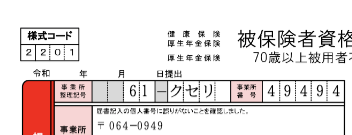

2021年1月18日（月）に行なったアップデートの詳細をお知らせします。

届出書類機能の変更点は、新機能1件・カイゼン1件でした。

# ✨ 新機能

## 「雇用保険被保険者資格取得届」の新様式に対応しました

「雇用保険被保険者資格取得届」が、在留カード番号を含むようになったため新しい様式に対応しました 。

**\[雇用保険被保険者資格取得届\]**

# 📈 カイゼン

## 「健康保険・厚生年金保険 被保険者資格喪失届」から \[書類提出日\] を削除しました

これまで「健康保険・厚生年金保険 被保険者資格喪失届」で連記式の電子申請を作成した際、個別の書類に別々の書類提出日が記載された場合は、PDFや電子申請にどの日付が記載されるか不定でした。

:::related
[2020/12/17 複数名の従業員情報を記載した「健康保険・厚生年金保険 被保険者資格喪失届」をプレビュー表示できるようにしました](https://knowledge.smarthr.jp/hc/ja/articles/1500000458981)
:::

このため今回の改修で、個別の書類から **\[書類提出日\]** の入力欄を削除し、PDF作成時にはこの欄は入力されないようにしました。

電子申請の際にはe-Govに対して書類提出日を送信する必要がありますが、こちらは送信した日の日付を採用するようになっています。

- **個別の書類情報画面**

| 変更前 | 変更後 |
| --- | --- |
|  |  |

- **PDF表示**

