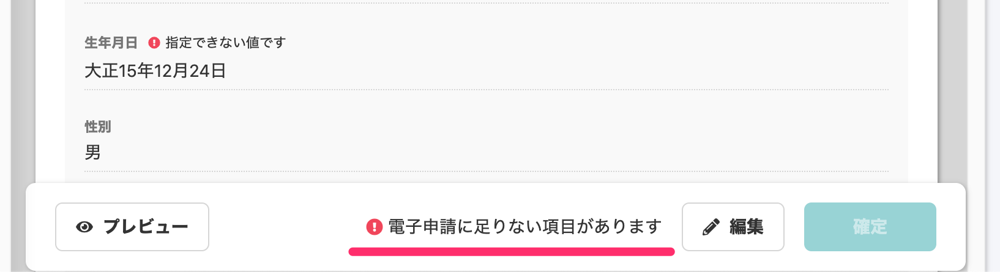

2020年9月04日（金）に行なったアップデートの詳細をお知らせします。

届出書類機能のリリースは、カイゼン1件でした。

# 📈カイゼン

## 書類確定前のエラーのメッセージを変更しました

電子申請に必須の項目が埋められていなかったり、電子申請の仕様として定められた様式を満たしていなかったりする場合に表示されるエラーのメッセージを変更しました。

これまでは「足りない項目がある」とだけ明示していましたが、今回の改修で、「修正の操作が必要」だということをお伝えするメッセージになりました。

| 変更前 |  |
| --- | --- |
| 変更後 |  |

今回のカイゼンは、実際にいただいたお問い合わせをきっかけに行なったものです。

引き続き、機能の問い合わせやご意見をいただけたらうれしいです！
