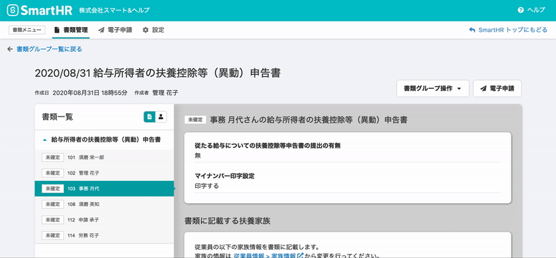
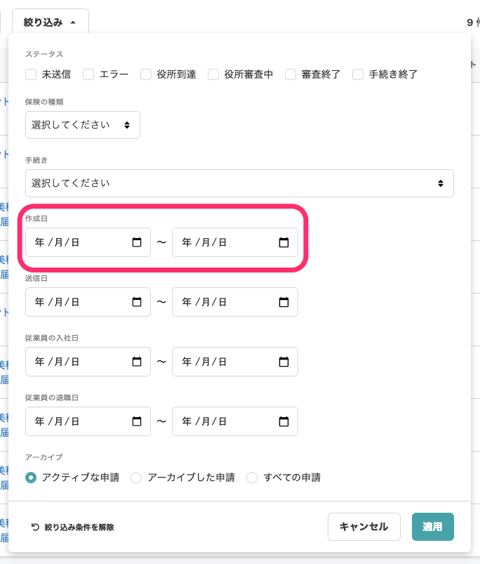
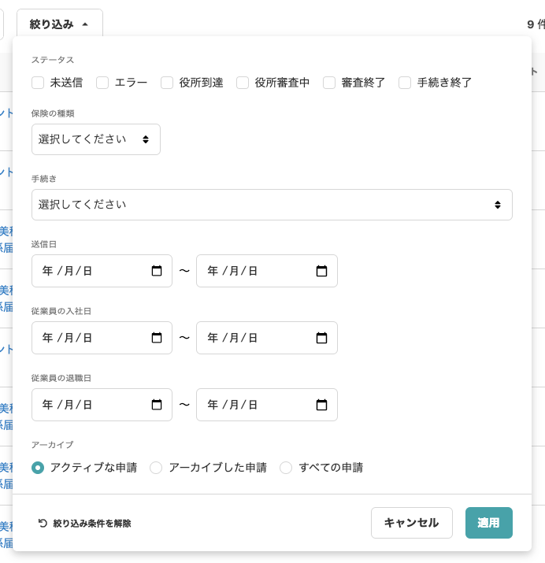

2020年9月16日（水）に行なったアップデートの詳細をお知らせします。

届出書類機能のリリースは、カイゼン2件でした。

# 📈カイゼン

## 書類グループ詳細で左側の書類名や従業員名をクリックした際に、すぐに選択が反映される状態にしました

書類グループ詳細の左側の **\[書類一覧\]** の書類をクリックした際、 これまでは右側に書類情報が反映されるまで左側の一覧の選択状態は変わらず、反映が遅い仕様でした。

今回、右側に反映される前に先に左側の選択状態が切り替わるように変更し、クリックへの反応がすぐわかるように改善しました。

従業員ごと・書類ごと、どちらも対応させています。

左：**\[書類一覧\]** の従業員氏名をクリックすると、氏名欄が緑色になり、右：当該従業員の書類関連情報が表示されます。

## 電子申請一覧の絞り込みから \[作成日\] を削除しました

電子申請一覧ページの絞り込み条件を整理するため、使用する場面があまりない **\[作成日\]** の項目を削除しました。

**変更前**

**変更後**

