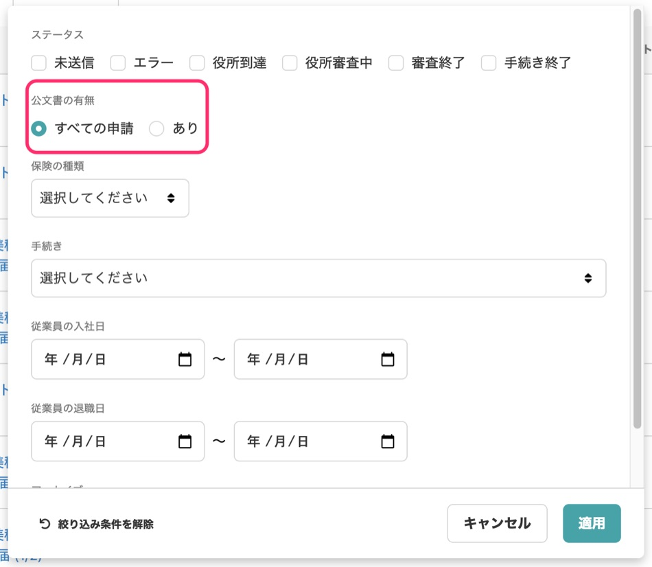
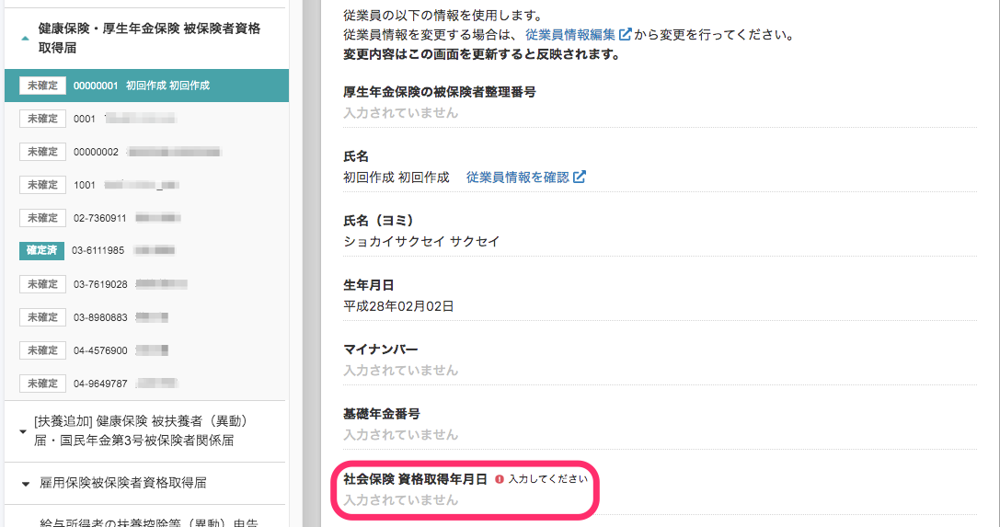
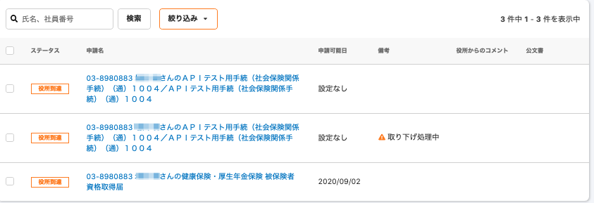
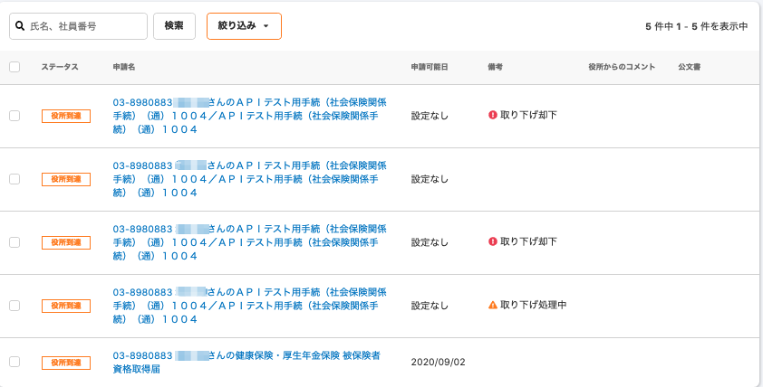

2020年9月17日（木）に行なったアップデートの詳細をお知らせします。

届出書類機能のリリースは、新機能1件・カイゼン3件でした。

# ✨新機能

## 電子申請一覧の絞り込み機能に、\[公文書の有無\] を追加しました

電子申請一覧の絞り込み機能の欄に、**\[公文書の有無\]** の項目を追加しました。

雇用保険の取得届などで「審査終了したが、公文書が届いていない」という場合、公文書が届くまでは定期的にチェックする業務が発生し、煩雑でした。

今回追加した機能を使うと、公文書の有無を「あり」で絞り込み、公文書が届いたものから順次アーカイブができるので、確認作業の負担軽減にぜひご活用ください😄

# 📈カイゼン

## 電子申請一覧の絞り込みの項目から \[送信日\] を削除しました

通常は、申請可能日に書類を送信しているので、**\[申請可能日\]** が追加されたことで、**\[送信日\]** が重複してしまいました。

そこで、今回のアップデートで一覧画面上の **\[送信日\]** の項目を削除しました。

## \[健康保険・厚生年金保険 被保険者資格取得届\] で \[資格取得年月日\] を必須項目にしました

**\[健康保険・厚生年金保険 被保険者資格取得届\]** の書類で、 **\[資格取得年月日\]** を必須項目にしました。

資格取得日は、e-Govの仕様上は必須項目ではありませんが、申請可能日として使用され、空欄で提出すると返戻されてしまう仕組みになっています。そのため、**\[資格取得年月日\]** を入力必須の項目にしました。

画面では、資格取得日の設定をしていない従業員ではエラーが表示され、**\[確定\]** ボタンが押せないようになりました。

## \[役所到達\] ステータスで絞り込みした際、 \[取り下げ却下\] の役所到達電子申請も結果に含まれるようになりました

これまでは、**\[役所到達\]** ステータスで絞り込みをしたときに、**\[取り下げ却下\]** の役所到達電子申請が検索結果に含まれていませんでした。

今回の作業で、**\[取り下げ却下\]** の役所到達電子申請も検索結果に含まれるように変更されました。

**変更前**

**変更後**

