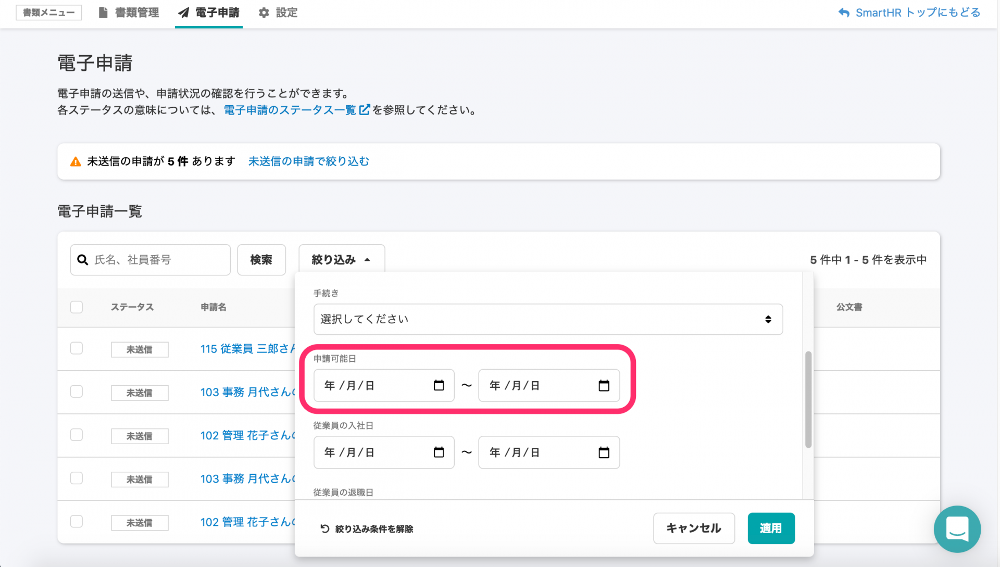

2020年9月18日（金）に行なったアップデートの詳細をお知らせします。

届出書類機能のリリースは、新機能1件、カイゼン1件でした。

# ✨新機能

## 申請可能日での絞り込み検索ができるようになりました

電子申請一覧の絞り込み条件に **\[申請可能日\]** を追加し、申請可能日で検索できるようにしました。

# 📈カイゼン

## 書類グループ一覧画面へ遷移した際の画面表示がスムーズになるようにしました

書類グループ一覧画面へ遷移した際の画面表示がスムーズになるようにカイゼンしました。
