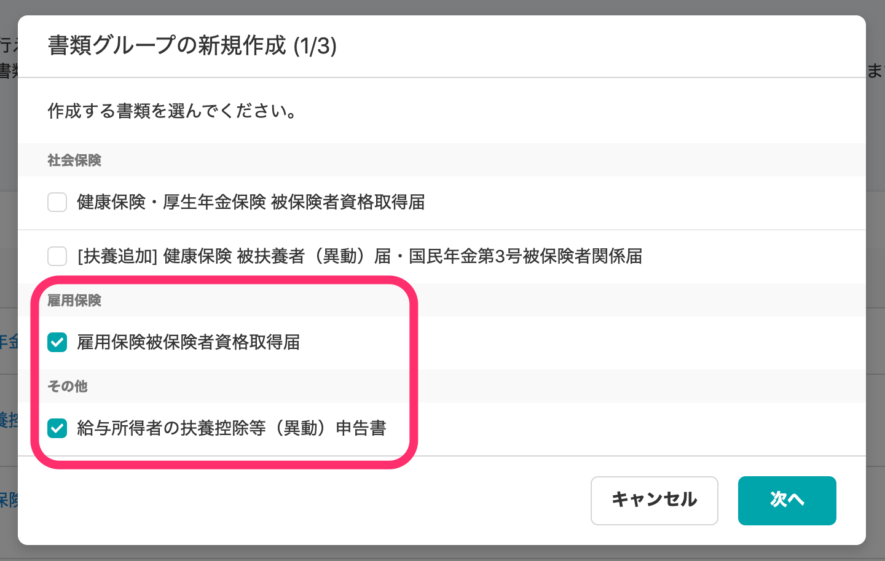
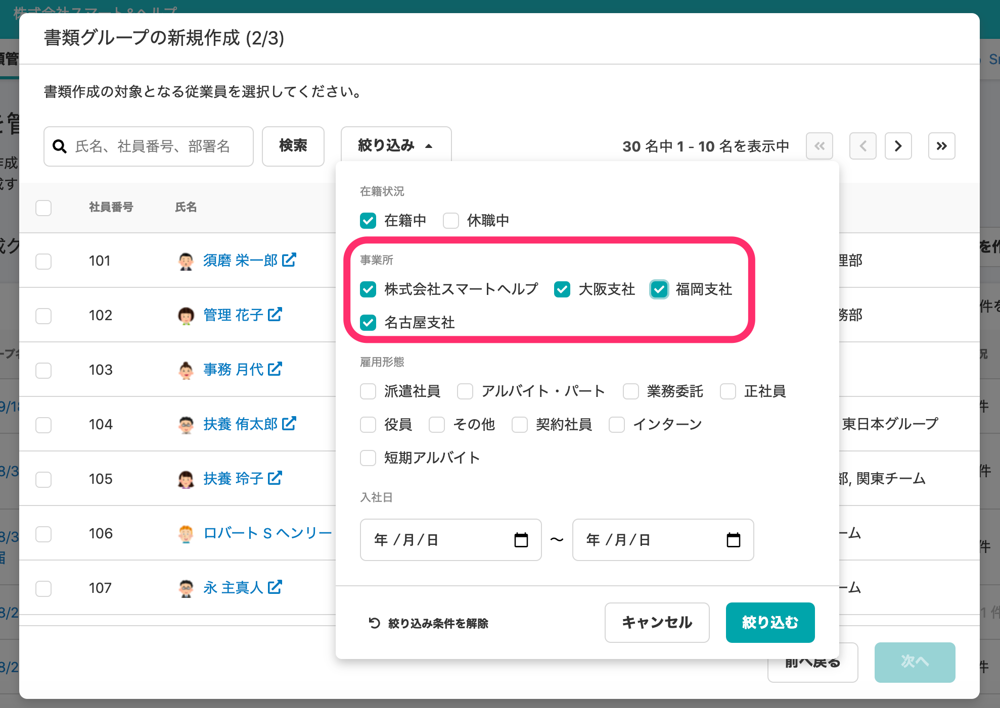

2020年9月28日（月）に行なったアップデートの詳細をお知らせします。

届出書類機能のリリースは、カイゼン1件、不具合修正4件でした。

# 📈 カイゼン

## 協会けんぽではない事業所でも、給与所得者の扶養控除等申告書や雇用保険の書類を作成できるようにしました

これまでは、協会けんぽ以外の事業所を選択できないようにグレーアウトされていましたが、今回の改善作業で、社会保険の書類以外は、どの事業所でも選択できるようになりました。

**\[+新しく書類を作成する\] > \[書類グループの新規作成\]** のダイアログを開き、 **\[雇用保険\]** や **\[その他\]** の書類にチェックを入れます。

**\[絞り込み\]** をプルダウンし、事業所を選択できます。

# 👨‍⚕️ 不具合修正

事業所設定項目の入力の不具合など、4件の修正を行ないました。
