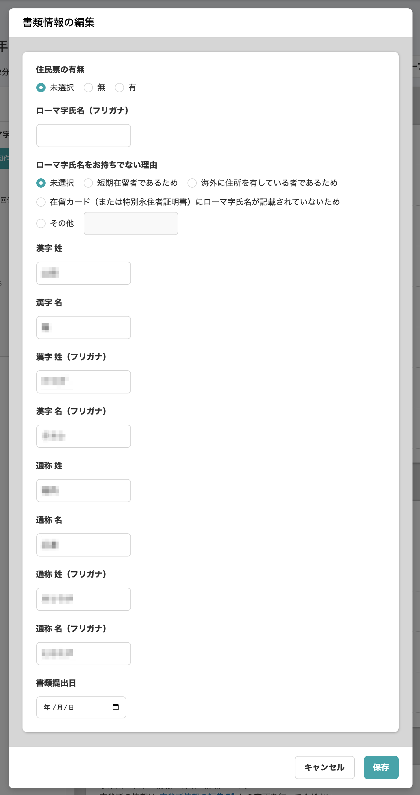
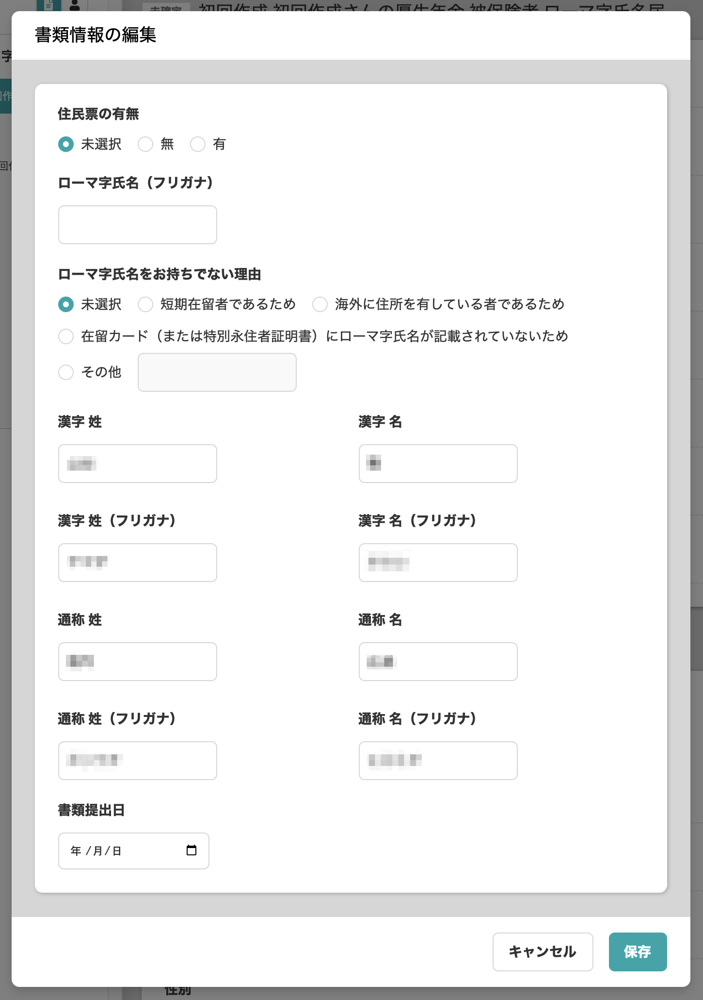

2020年10月7日（水）に行なったアップデートの詳細をお知らせします。

届出書類機能のリリースは、カイゼン1件でした。

# 📈 カイゼン

## 厚生年金被保険者 ローマ字氏名届の編集フォームの姓と名を横並びにしました

これまで、**\[厚生年金被保険者 ローマ字氏名届\]** の編集フォームでの姓名の並びが縦になっていて 、プレビュー画面と一致しておらずわかりにくい状態でした。

今回のカイゼンで、**\[漢字 姓\] \[漢字 名\]** と**\[漢字 姓（フリガナ）\] \[漢字 名（フリガナ）\]** を横並びに配置し、わかりやすい表示にしました。

| 変更前 |  |
| --- | --- |
| 変更後 |  |
