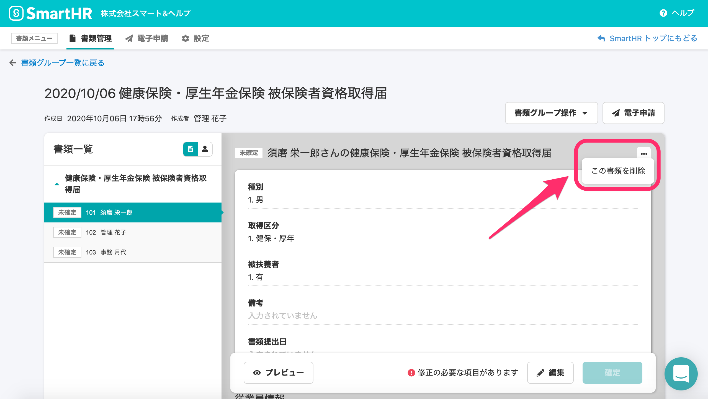
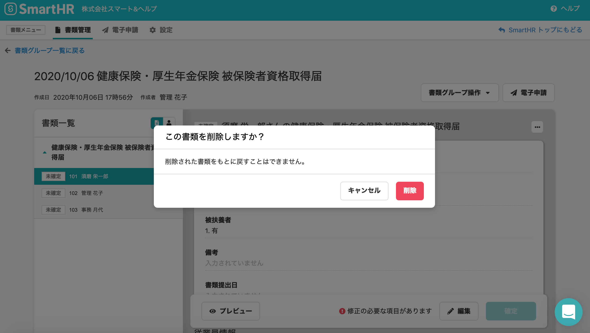

2020年10月12日（月）に行なったアップデートの詳細をお知らせします。

届出書類機能のリリースは、新機能1件でした。

# ✨ 新機能

## 書類グループ内の書類を個別に削除できるようにしました

1つの作業グループ内でも、従業員の方の状況により必要な書類が異なる場合がありますが、これまでは不要な書類を削除できず、管理しにくいという課題がありました。

そのため、今回の改修でグループ作成後に書類を個別に削除できるようにしました。

書類を削除する場合は、書類作成グループ一覧から削除したい書類を選び、書類の詳細画面の右上にある三点リーダーから**\[この書類を削除\]** をクリックしてください。

確認のダイアログが表示されるので、**\[削除\]** をクリックすると削除されます。

