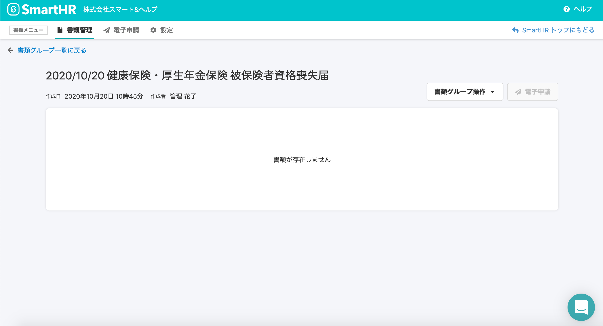
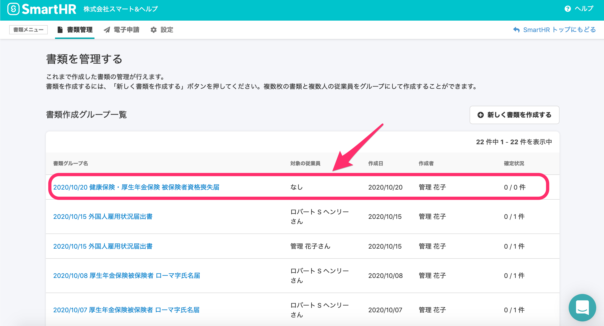

2020年10月23日（金）に行なったアップデートの詳細をお知らせします。

届出書類機能のリリースは、カイゼン1件でした。

# 📈 カイゼン

## 書類グループで最後に残った書類も削除できるようにしました

これまでは書類グループ内の最後1枚の書類は削除できず、書類グループ自体を削除するような仕様でしたが、今後の改修を考慮し、最後の書類も削除できるようにしました。

**詳細画面**

**一覧画面**

