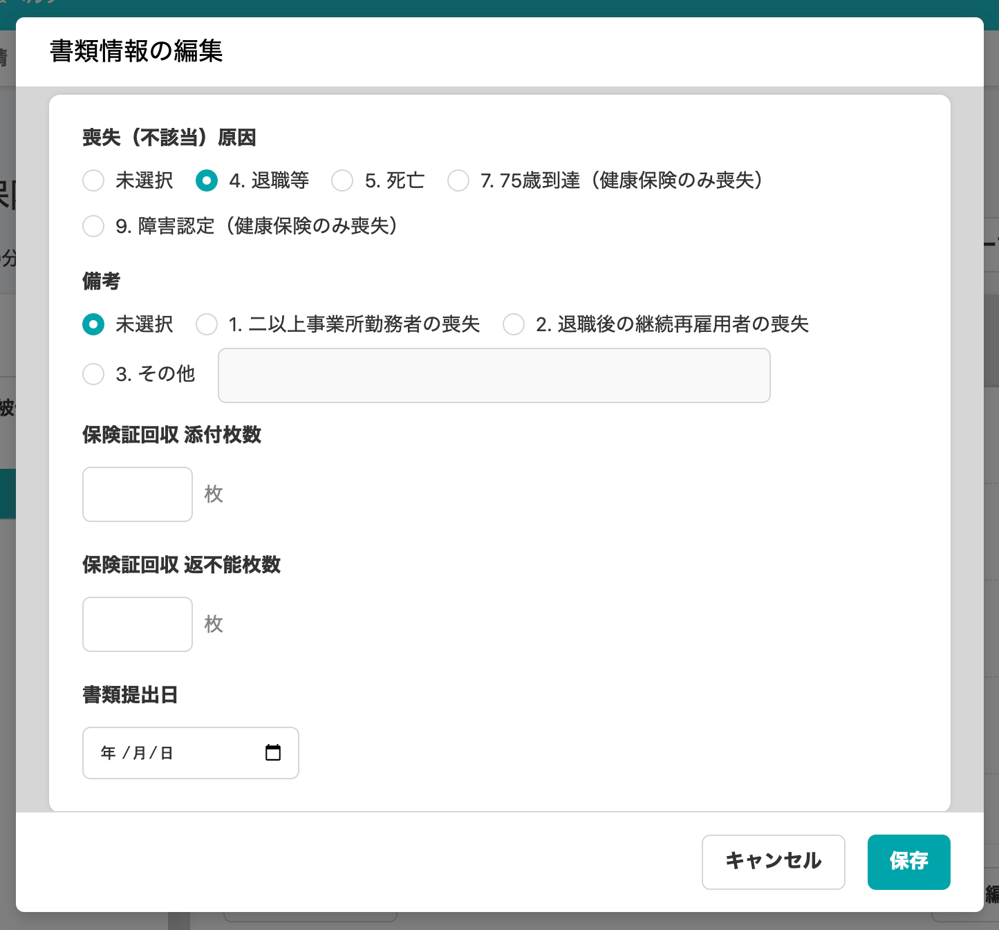
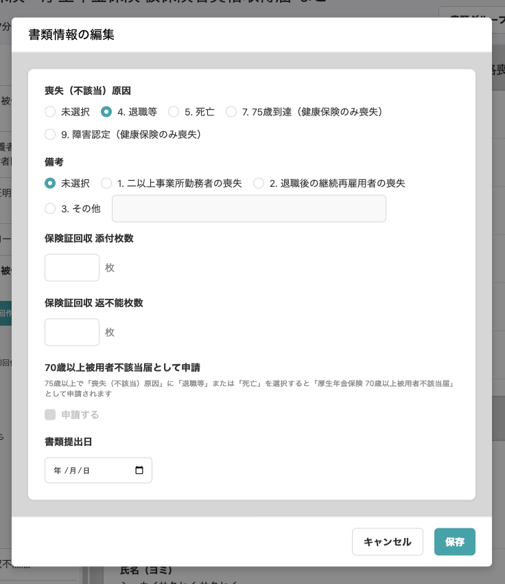

2020年10月26日（月）に行なったアップデートの詳細をお知らせします。

届出書類機能のリリースは、カイゼン1件でした。

# 📈 カイゼン

## 「70歳以上被用者不該当届として申請」の欄を追加しました

健康保険・厚生年金保険 被保険者資格喪失届に **\[70歳以上被用者不該当届として申請\]** の欄を追加し、どのような場合に **\[申請する\] \[申請しない\]** が切り替わるのかをわかりやすくしました。

この欄は直接編集できませんが、被保険者が資格喪失日時点で75歳以上であり、**\[喪失（不該当）原因\]** 欄で **\[退職等\]** または **\[死亡\]** が選択されている場合のみ、自動で **\[申請する\]** にチェックが入ります。

| 変更前 |  |
| --- | --- |
| 変更後 |  |
