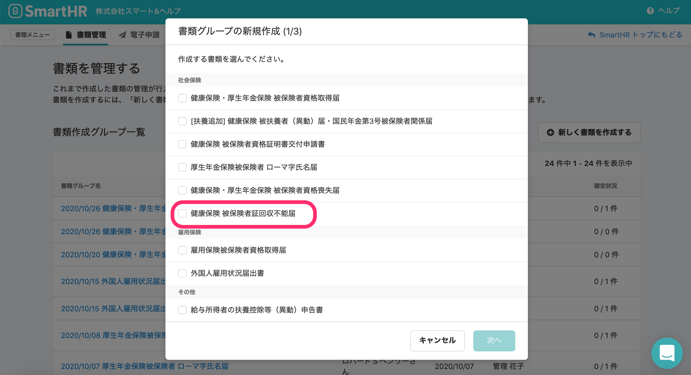
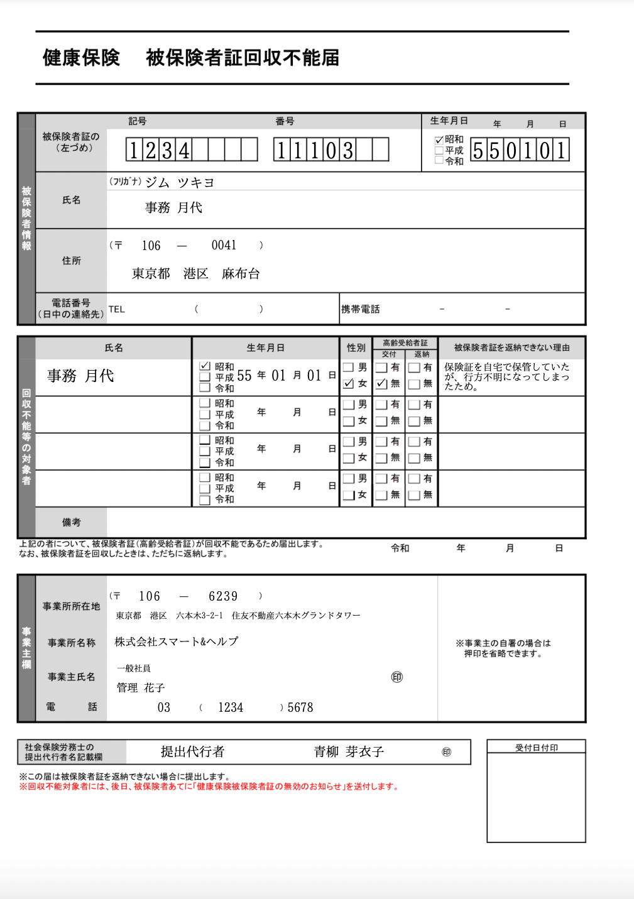

2020年10月30日（金）に行なったアップデートの詳細をお知らせします。

届出書類機能の変更点は、新機能1件でした。

# ✨ 新機能

## 「健康保険 被保険者証回収不能届」に対応しました

新しい書類「健康保険 被保険者証回収不能届」に対応しました。

協会健保の事業所の従業員に対してのみ作成可能です。

**\[書類グループの新規作成\]** 画面

**\[健康保険 被保険者証回収不能届\]**

