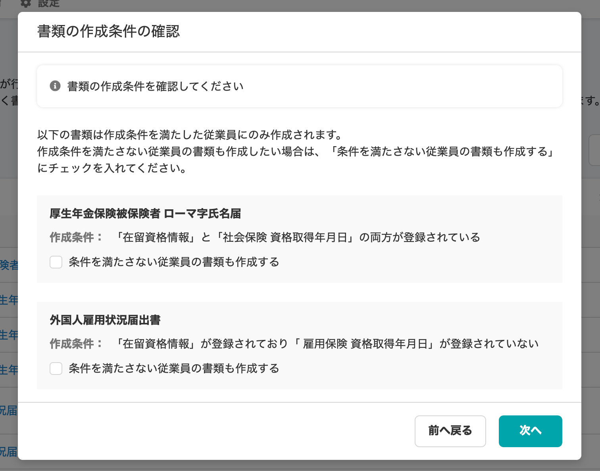

2020年11月9日（月）に行なったアップデートの詳細をお知らせします。

届出書類機能のリリースは、新機能1件でした。

# ✨新機能

## 条件を満たした従業員の書類のみを作成できるようにしました

たとえば外国人のみ提出が必要な書類など特定の従業員だけが作成する書類は、条件を満たした従業員のみに対して自動で書類が作成できるようになりました。

このような特定の条件の書類を作成しようとする際は、 **\[書類の作成条件の確認\]** ダイアログが表示され、

- 作成条件の内容
- 作成条件を満たさない従業員の書類も作成するかどうか

を確認できるようになっています。

条件を満たしていなくても作成が必要な場合は、 **\[条件を満たさない従業員の書類も作成する\]** にチェックを入れてください。

現時点での対象書類は下記のとおりです。

- 健康保険 被扶養者（異動）届・国民年金第3号被保険者関係届
- 厚生年金保険被保険者 ローマ字氏名届
- 外国人雇用状況届出書

**\[書類の作成条件の確認\]**
