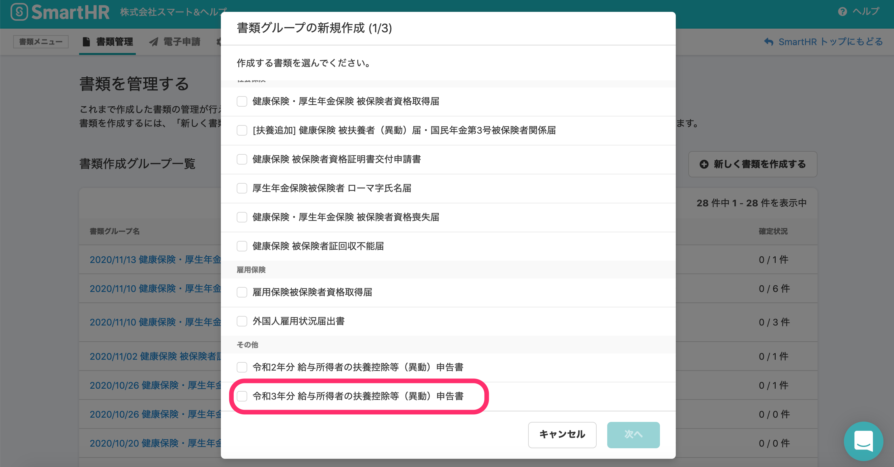
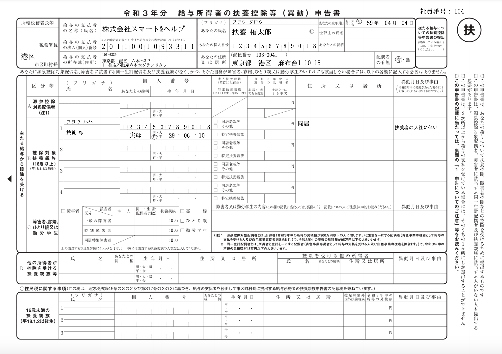
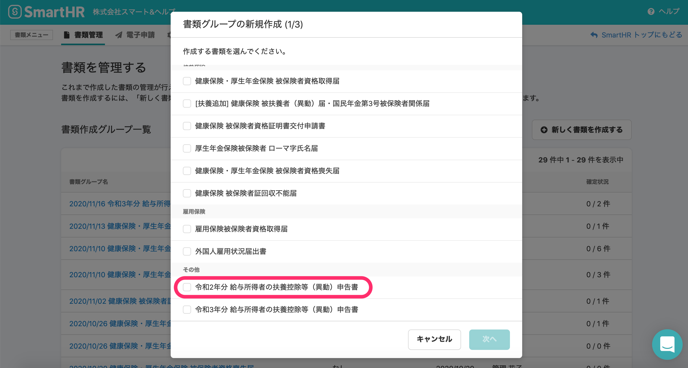
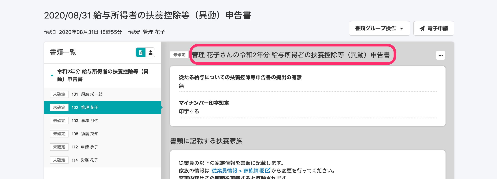

2020年11月13日（金）に行なったアップデートの詳細をお知らせします。

届出書類機能の変更点は、新機能1件・カイゼン2件・不具合修正1件でした。

# ✨ 新機能

## 「令和3年分 給与所得者の扶養控除等（異動）申告書」に対応しました

新しい書類「令和3年分 給与所得者の扶養控除等（異動）申告書」に対応しました。

**\[書類グループの新規作成\]** 画面

**\[令和3年分 給与所得者の扶養控除等（異動）申告書\]**

# 📈 カイゼン

## 「令和2年分 給与所得者の扶養控除等（異動）申告書」の書類名に\[令和2年分\]を追加 しました

これまで「給与所得者の扶養控除等（異動）申告書」は令和2年分の作成のみだったため年度をつけていませんでしたが、今回のリリースで令和3年分の書類が作れるようになったため、書類名に **\[令和2年分\]** をつけて区別できるようにしました。

**\[書類グループの新規作成\]** 画面

**既存の書類詳細画面**

## セッションが切れたとき届出書類のトップページに切り替わるようにしました

これまで認証セッションが切れた場合はエラー画面が表示されるだけでしたが、エラー画面を表示したあとに自動で届出書類のトップページに画面が切り替わるようになりました。

# 👨‍⚕️ 不具合修正

公文書の保持期限に関する1件の不具合修正を行ないました。
