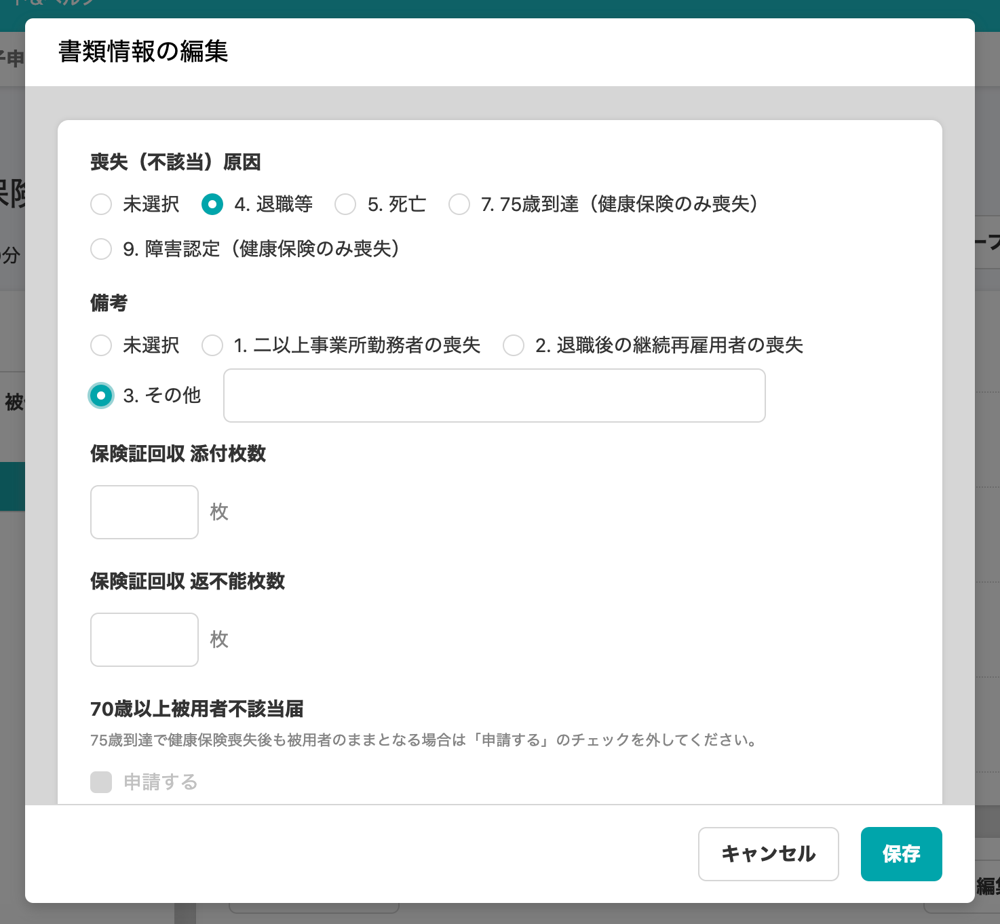
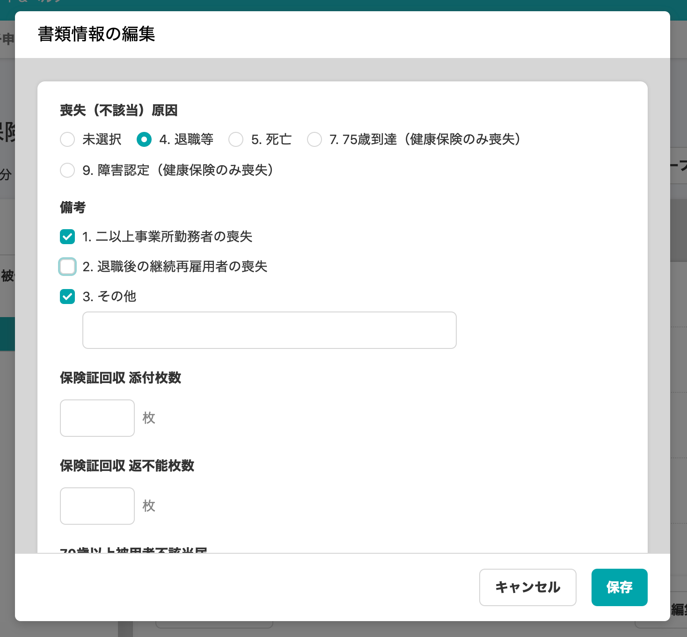

2020年11月19日（木）に行なったアップデートの詳細をお知らせします。

届出書類機能の変更点は、カイゼン2件でした。

# 📈 カイゼン

## 電子申請詳細画面のデザインを新しくしました

**\[電子申請\]**タブ> 電子申請詳細画面の **\[申請内容\]** の項目を下記のとおりに変更し、デザインを新しくしました。

- **\[対象の従業員\]** を削除
- **\[書類グループ\]** を追加（リンクをクリックすると書類グループ詳細画面へ移動します）

| 変更前 |  |
| --- | --- |
| 変更後 |  |

## 「健康保険・厚生年金保険 被保険者資格喪失届」の備考項目をチェックボックスで選択するようにしました

「健康保険・厚生年金保険 被保険者資格喪失届」の **\[書類情報の編集\]** > **\[備考\]** の選択肢を、「ラジオボタン形式」から複数選択できる「チェックボックス形式」にしました。

| 変更前 |  |
| --- | --- |
| 変更後 |  |
