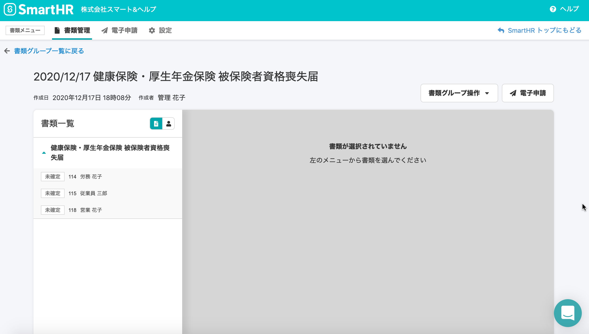
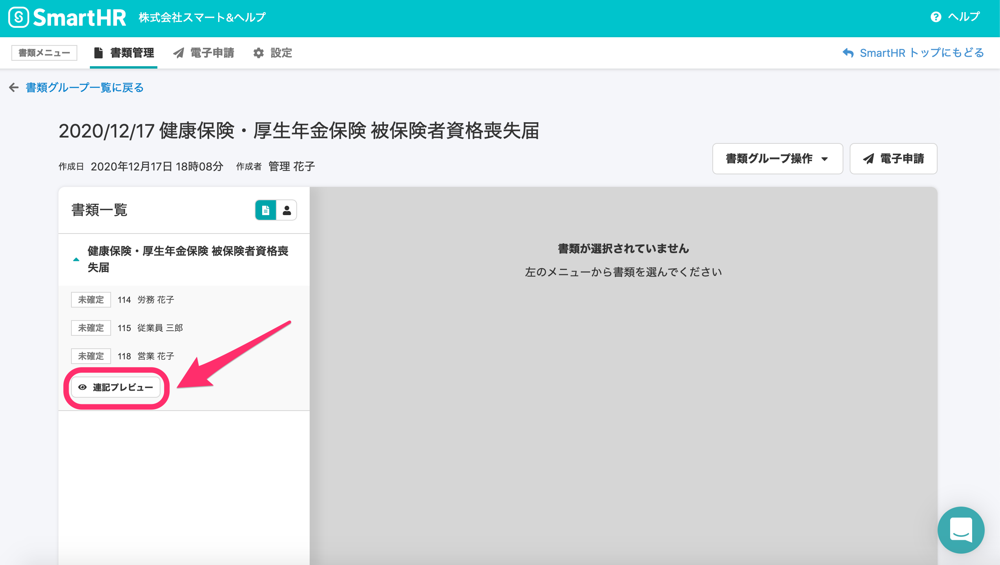
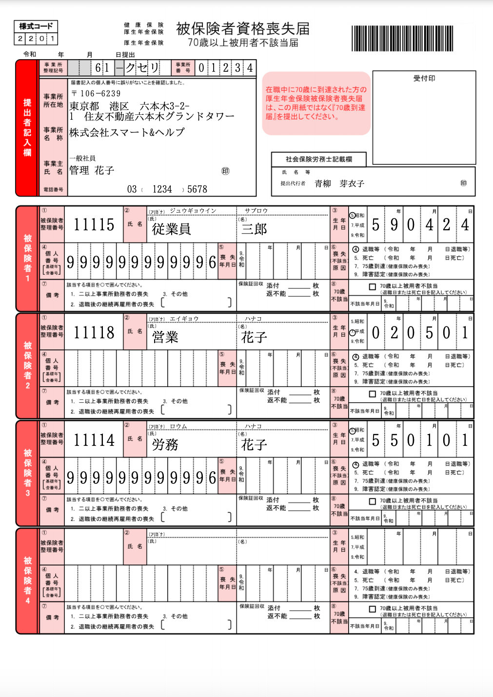

2020年12月17日（木）に行なったアップデートの詳細をお知らせします。

届出書類機能の変更点は、新機能1件でした。

# ✨ 新機能

## 複数名の従業員情報を記載した「健康保険・厚生年金保険 被保険者資格喪失届」をプレビュー表示できるようにしました

これまでは従業員一人ずつの書類プレビュー表示のみ可能でしたが、複数名の従業員が記載された「連記式」書類をプレビュー表示できるようにしました。

現在連記式に対応している書類は、「健康保険・厚生年金保険 被保険者比較喪失届」のみです。

書類グループ詳細画面の、従業員リスト下 > **\[連記プレビュー\]** ボタンをクリックすると確認できます。

| 変更前 |  |
| --- | --- |
| 変更後 |  |

「**健康保険・厚生年金保険 被保険者比較喪失届**」連記式プレビュー画面

