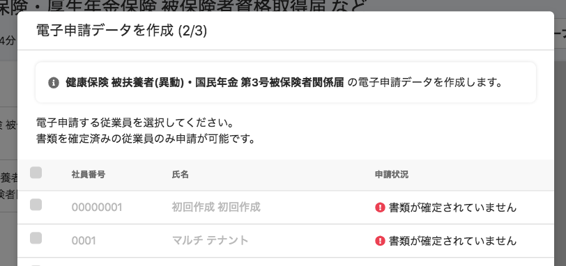
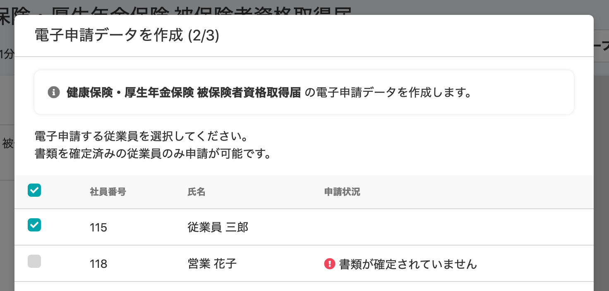

2020年12月18日（金）に行なったアップデートの詳細をお知らせします。

届出書類機能の変更点は、カイゼン1件でした。

# 📈 カイゼン

## 電子申請データ作成ダイアログの未確定従業員の文字色を濃くしました

これまで **\[電子申請データを作成\]** ダイアログの未確定従業員の **\[社員番号\]** と **\[氏名\]** の文字色は灰色で、読みにくいものでした。

こちらを確定済み従業員と同じ黒に変更し、読みやすくしました。

**\[書類グループ\]** 詳細 > 紙飛行機マーク**\[電子申請\]** から確認できます。

| 変更前 |  |
| --- | --- |
| 変更後 |  |
