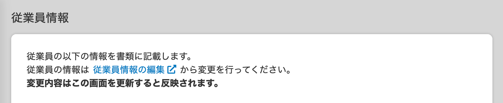
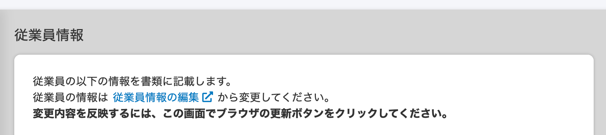
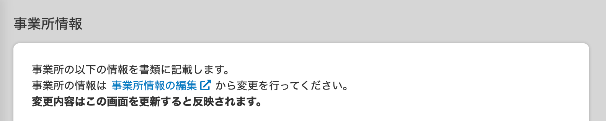
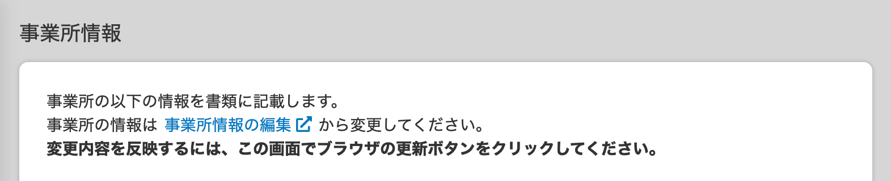
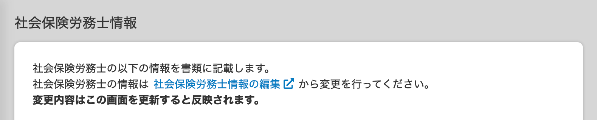
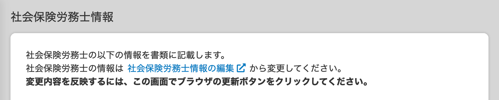
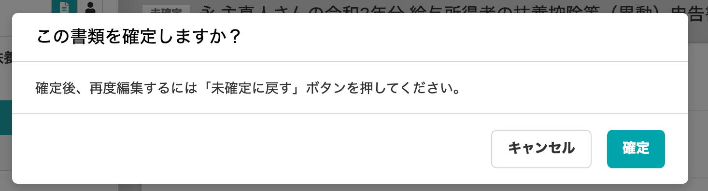
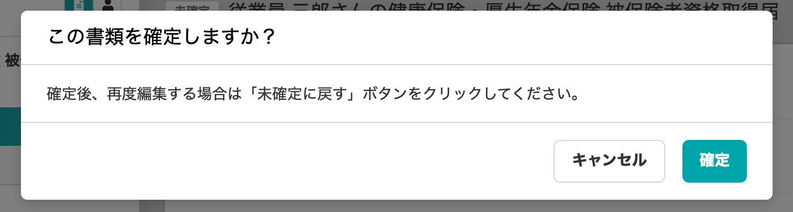
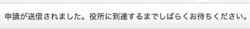

2021年1月8日（金）に行なったアップデートの詳細をお知らせします。

届出書類機能の変更点は、カイゼン1件・不具合修正1件でした。

# 📈 カイゼン

## 書類グループ一覧と書類情報画面の文言を変更しました

SmartHRの全体での表記ルールに合わせるため、書類グループ一覧と書類情報画面の文言を変更しました。

詳しい変更箇所と内容は、下記のとおりです。

#### 書類グループ一覧のタイトル下の説明文

- **変更前**

これまで作成した書類の管理が行えます。

書類を作成するには、「新しく書類を作成する」ボタンを押してください。複数枚の書類と複数人の従業員をグループにして作成することができます。

- **変更後**

これまで作成した書類を管理できます。

書類を作成するには、「新しく書類を作成する」ボタンを押してください。詳しい使い方は「書類を作成する」をご覧ください。

| 変更前 |  |
| --- | --- |
| 変更後 |  |

#### 書類情報の詳細画面 > **\[従業員情報\]** のヒントメッセージ

- **変更前**

従業員の以下の情報を書類に記載します。

従業員の情報は従業員情報の編集から変更を行ってください。

変更内容はこの画面を更新すると反映されます。

- **変更後**

従業員の以下の情報を書類に記載します。

従業員の情報は従業員情報の編集から変更してください。

変更内容を反映するには、この画面でブラウザの更新ボタンをクリックしてください。

| 変更前 |  |
| --- | --- |
| 変更後 |  |

#### 書類情報の詳細画面 > **\[事業所情報\]** のヒントメッセージ

- **変更前**

事業所の以下の情報を書類に記載します。

事業所の情報は事業所情報の編集から変更を行ってください。

変更内容はこの画面を更新すると反映されます。

- **変更後**

事業所の以下の情報を書類に記載します。

事業所の情報は事業所情報の編集から変更してください。

変更内容を反映するには、この画面でブラウザの更新ボタンをクリックしてください。

| 変更前 |  |
| --- | --- |
| 変更後 |  |

#### 書類情報の詳細画面 >****\[社会保険労務士\]**** のヒントメッセージ

- **変更前**

社労保険労務士の以下の情報を書類に記載します。

社労保険労務士の情報は社労保険労務士情報の編集から変更を行ってください。

変更内容はこの画面を更新すると反映されます。

- **変更後**

社労保険労務士の以下の情報を書類に記載します。

社労保険労務士の情報は社労保険労務士情報の編集から変更してください。

変更内容を反映するには、この画面でブラウザの更新ボタンをクリックしてください。

| 変更前 |  |
| --- | --- |
| 変更後 |  |

#### 書類確定時のメッセージ

- **変更前**

確定後、再度編集するには「未確定に戻す」ボタンを押してください。

- **変更後**

確定後、再度編集する場合は「未確定に戻す」ボタンをクリックしてください。

| 変更前 |  |
| --- | --- |
| 変更後 |  |

#### 電子申請送信後のメッセージ

- **変更前**

申請が送信されました。役所に到達するまでしばらくお待ち下さい。

- **変更後**

申請が送信されました。役所に到達するまでしばらくお待ちください。

| 変更前 |  |
| --- | --- |
| 変更後 |  |

# 👨‍⚕️ 不具合修正

書類をダウンロードする際の挙動に関する1件の不具合修正を行ないました。
