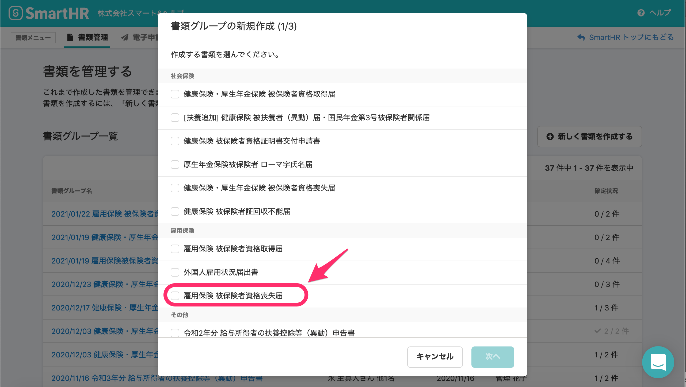
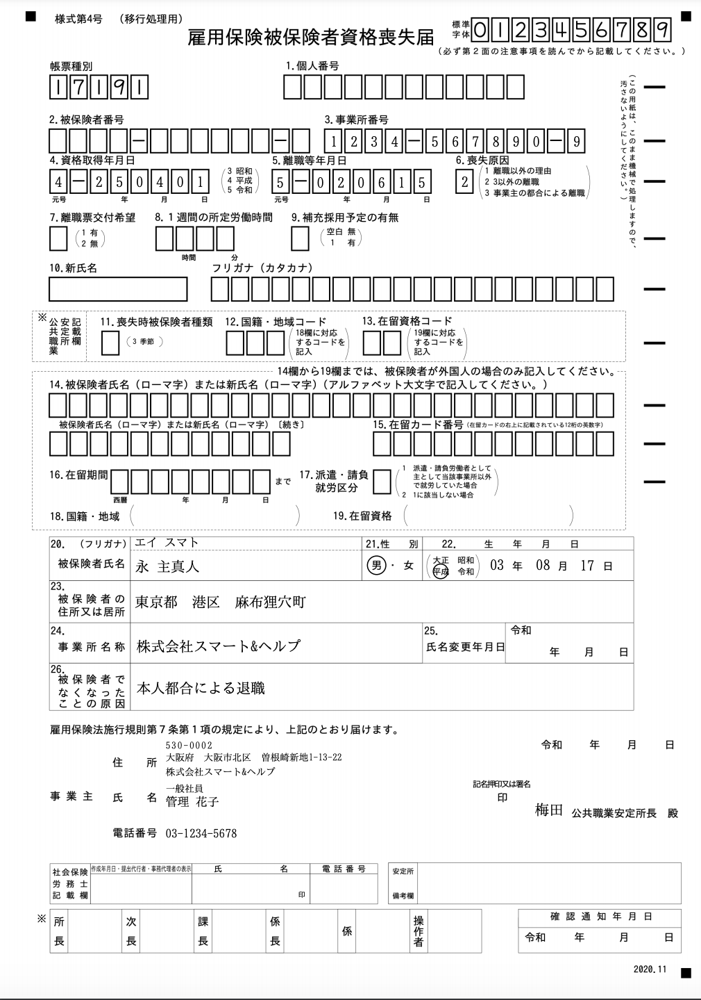
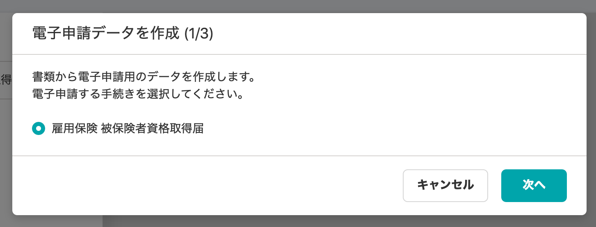
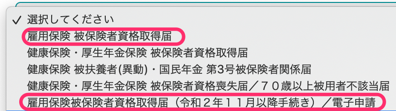
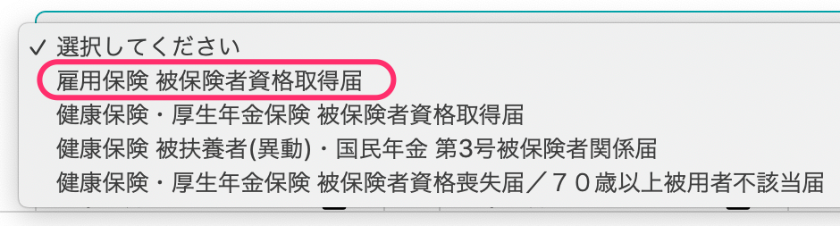

2021年1月22日（金）に行なったアップデートの詳細をお知らせします。

届出書類機能の変更点は、新機能1件・カイゼン2件・不具合修正2件でした。

# ✨ 新機能

## 「雇用保険 被保険者資格喪失届」に対応しました

新しい書類「雇用保険 被保険者資格喪失届」に対応しました。

**\[書類グループの新規作成\]**画面

**\[雇用保険 被保険者資格喪失届\]**

# 📈 カイゼン

## 電子申請手続名を簡略化しました

**\[雇用保険被保険者資格取得届（令和２年１１月以降手続き）／電子申請\]** の電子手続き名が冗長だったため、 **\[雇用保険被保険者資格取得届\]** に変更しました。

## 電子申請の「雇用保険被保険者資格取得届」のバージョンを1つにしました

これまで電子申請の手続きを選択する際に、「雇用保険被保険者資格取得届」が、「令和2年11月以降」と「それ以前」の2つの書類として存在し別の手続きとして扱われていました。

そのため今回の改修で、「雇用保険被保険者資格取得届」を1つにまとめ分かりやすくしました。

| 変更前 | 変更後 |
| --- | --- |
|  |  |

# 👨‍⚕️ 不具合修正

セッション切れの際の挙動に関する修正など、2件の不具合修正を行ないました。
