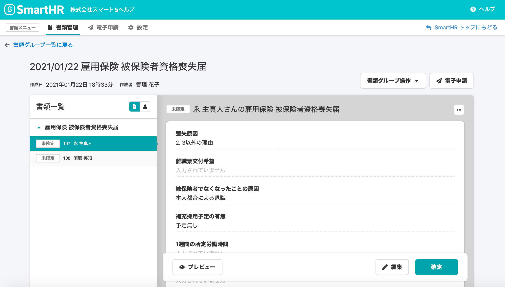
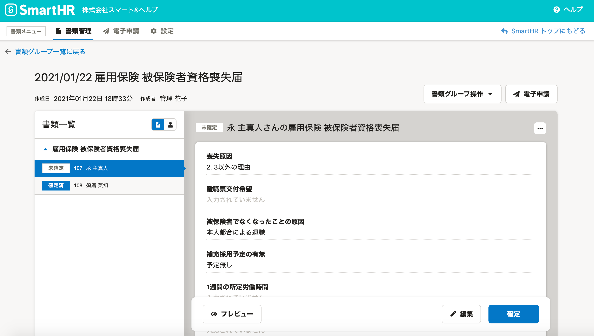
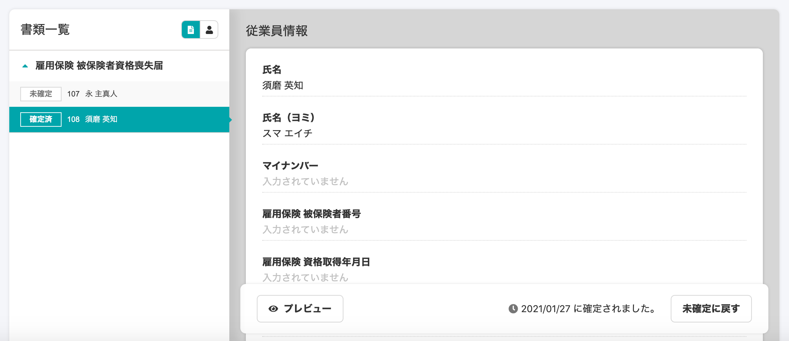
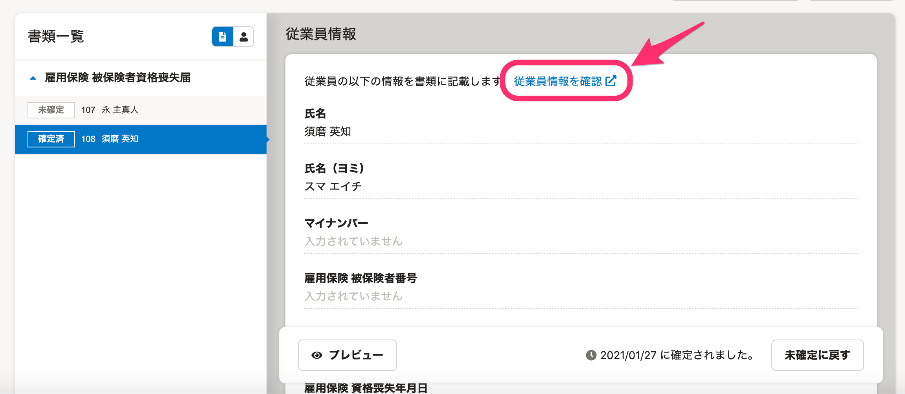

2021年1月27日（水）に行なったアップデートの詳細をお知らせします。

届出書類機能の変更点は、カイゼン2件でした。

# 🎢 アクセシビリティ

## 画面のカラーを新しくしました

視認性向上の取り組みの一環で、届出書類機能画面を新しいカラーにしました。

:::related
[SmartHRの画面のカラーが新しくなります](https://smarthr.jp/update/21763)
:::

| 変更前 |  |
| --- | --- |
| 変更後 |  |

# 📈 カイゼン

## 書類確定後の画面にも従業員情報へのリンクを置きました

これまでは書類確定前の段階のみ従業員情報へのリンクが置かれ、確定後はリンクが表示されない仕様でした。

今回の改修で書類確定後にも従業員情報を確認できるように、氏名の横に **\[従業員情報を確認\]** のリンクを置きました。

| 変更前 |  |
| --- | --- |
| 変更後 |  |
