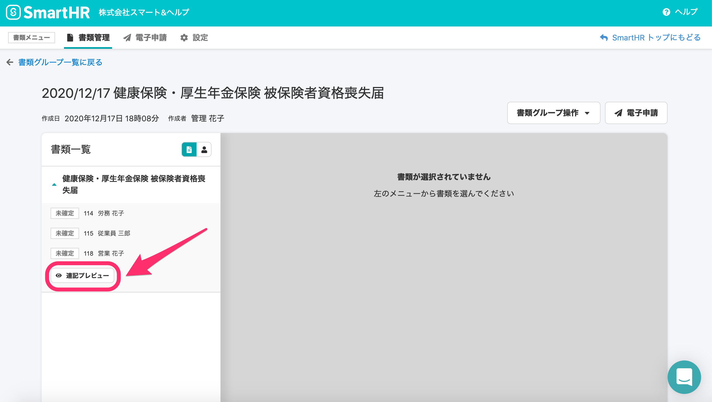

2021年3月8日（月）に行なったアップデートの詳細をお知らせします。

届出書類機能の変更点は、カイゼン5件でした。

# 📈 カイゼン

## 電子申請作成ダイアログの文言を \[備考\] に変更しました

電子申請作成ダイアログのヘッダーの項目名を **\[申請状況\]** から、内容に適した **\[備考\]** に変更しました。

| 変更前 |  |
| --- | --- |
| 変更後 |  |

## 書類グループ削除時の文言を変更しました

これまで書類グループを削除する際に、ステータスが「未送信」や「エラー」の電子申請が含まれていても、それに関する注意書きの記載がありませんでした。

そのため今回の改修で、下記のとおり注意書きの文言を追加しました。

| 変更前 |  |
| --- | --- |
| 変更後 |  |

## \[連記プレビュー\] ボタンを \[まとめてプレビュー\] の文言に変更しました

「健康保険・厚生年金保険 被保険者資格喪失届」の「連記式」書類をプレビュー表示する **\[連記プレビュー\]** ボタンの文言を **\[まとめてプレビュー\]** に変更し、意味を分かりやすくしました。

| 変更前 |  |
| --- | --- |
| 変更後 |  |

:::related
[2020/12/17 複数名の従業員情報を記載した「健康保険・厚生年金保険 被保険者資格喪失届」をプレビュー表示できるようにしました](https://knowledge.smarthr.jp/hc/ja/articles/1500000458981)
:::

## メール送信元の名前を SmartHR <no-reply@smarthr.jp> に変更しました

これまでは、電子申請を作成すると送られるメール送信元の名前は **\[no-reply@smarthr.jp\]** のみでしたが、 今回の改修で **\[SmartHR <no-reply@smarthr.jp>\]** に変更し、送信元の名前を明記するようにしました。

## 電子申請作成時のお知らせメールの文面を変更しました

電子申請を作成した際に送られるメールの本文を、より汎用的な表現に変更しました。

