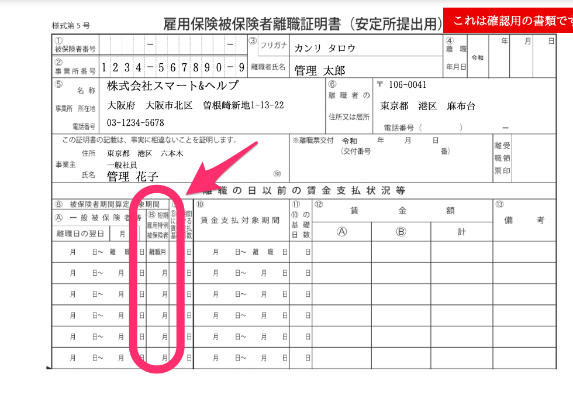
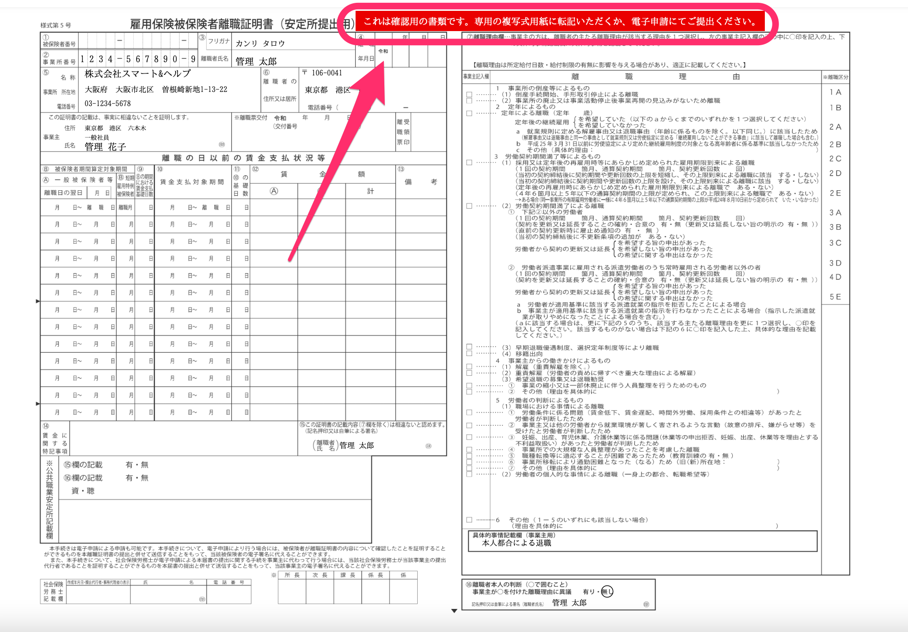

2021年3月24日（水）に行なったアップデートの詳細をお知らせします。

届出書類機能の変更点は、新機能1件・カイゼン1件でした。

# ✨ 新機能

## 「雇用保険 被保険者離職証明書」の［短期雇用特例被保険者］に対応しました

「雇用保険 被保険者離職証明書」の「離職日以前の賃金支払状況等」の表に **［短期雇用特例被保険者］** の列を追加し対応しました。

# 📈 カイゼン

## 「雇用保険被保険者離職証明書」のPDF上の注意文言を変更しました

「雇用保険被保険者離職証明書」のPDF画面上部に表示する文言を **［これは確認用の書類です。専用の複写式用紙に転記いただくか、電子申請にてご提出ください。］** に変更し、PDFのプレビューの目的を明確にしました。

